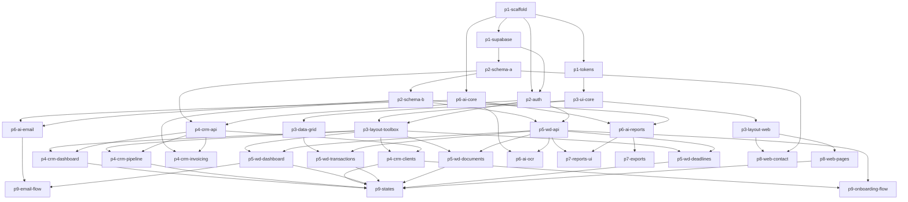

# Barker Build Plan — Numera Accounting Platform

```yaml
# ============================================================
# BARKER BUILD PLAN — NUMERA ACCOUNTING PLATFORM
# ============================================================

project:
  name: "numera-accounting"
  description: "Accounting service platform — CRM, AI-powered Workdesk, and marketing website for PH bookkeeping/tax firm"
  working_directory: "."

input_files:
  - path: "DISCOVERY.md"
    alias: "discovery"
    description: "Discovery brief — architecture, scope, design system, workflows, all locked decisions"

# ============================================================
# PHASE 1: FOUNDATION
# ============================================================
phases:
  - id: "phase-1"
    name: "Foundation"
    description: "Monorepo scaffolding, Supabase config, design tokens"
    phase_check: "pnpm run type-check"
    tasks:
      - id: "p1-scaffold"
        name: "Monorepo scaffolding"
        model: "sonnet"
        depends_on: []
        estimated_minutes: 15
        context_sources:
          - alias: "discovery"
            sections: ["5"]
        prompt: |
          Initialize a Turborepo monorepo for the Numera accounting platform.

          Read the discovery doc section 5 for the full stack specification and repo structure.

          Create this exact structure:
          ```
          accounting-service/
          ├── apps/
          │   ├── web/              # Next.js 14+ (App Router) — marketing website
          │   └── toolbox/          # Next.js 14+ (App Router) — CRM + Workdesk
          ├── packages/
          │   ├── ui/               # Shared component library
          │   ├── db/               # Supabase client, types
          │   └── ai/               # AI pipeline utilities
          ├── supabase/
          │   ├── migrations/
          │   └── functions/
          ├── turbo.json
          ├── package.json
          └── tsconfig.json (base)
          ```

          Requirements:
          - Use pnpm as package manager
          - Both Next.js apps use App Router with TypeScript strict mode
          - Install and configure Tailwind CSS in both apps
          - Install shadcn/ui in both apps
          - Each package has its own package.json, tsconfig.json
          - packages/ui exports components, packages/db exports client + types, packages/ai exports utilities
          - turbo.json defines build, dev, lint, type-check pipelines
          - Create .env.example with placeholders: NEXT_PUBLIC_SUPABASE_URL, NEXT_PUBLIC_SUPABASE_ANON_KEY, SUPABASE_SERVICE_ROLE_KEY, CLAUDE_API_KEY, GMAIL_CLIENT_ID, GMAIL_CLIENT_SECRET
          - Root package.json scripts: dev, build, lint, type-check
          - .gitignore covers node_modules, .next, .env*, .turbo

          Hardening requirements:
          - TypeScript strict mode in all tsconfig files (strict: true, noUncheckedIndexedAccess: true)
          - ESLint with @typescript-eslint recommended rules
          - Prettier configured (printWidth: 100, singleQuote: true, trailingComma: "all")
          - All package cross-references use workspace:* protocol
          - Validate tsconfig paths resolve correctly between packages
        expected_files:
          - "package.json"
          - "pnpm-workspace.yaml"
          - "turbo.json"
          - "tsconfig.json"
          - ".gitignore"
          - ".env.example"
          - "apps/web/package.json"
          - "apps/web/next.config.ts"
          - "apps/toolbox/package.json"
          - "apps/toolbox/next.config.ts"
          - "packages/ui/package.json"
          - "packages/db/package.json"
          - "packages/ai/package.json"
        done_check: "test -f turbo.json && test -f apps/web/package.json && test -f apps/toolbox/package.json"

      - id: "p1-supabase"
        name: "Supabase project config"
        model: "sonnet"
        depends_on: ["p1-scaffold"]
        estimated_minutes: 10
        context_sources:
          - alias: "discovery"
            sections: ["5"]
        prompt: |
          Set up the Supabase local development environment for the Numera accounting platform.

          Read packages/db/package.json for the package setup.

          Requirements:
          1. Initialize Supabase CLI config at supabase/config.toml
          2. Create packages/db/src/client.ts:
             - Export createClient() for browser (NEXT_PUBLIC_SUPABASE_URL + NEXT_PUBLIC_SUPABASE_ANON_KEY)
             - Export createServiceClient() for server (SUPABASE_SERVICE_ROLE_KEY)
             - Uses @supabase/supabase-js v2
          3. Create packages/db/src/index.ts re-exporting everything
          4. Create supabase/seed.sql with placeholder comment
          5. Create packages/db/src/types/database.ts with placeholder Database type

          Install @supabase/supabase-js in packages/db.

          Hardening requirements:
          - Validate env vars at module load — throw clear error if missing
          - Use TypeScript generics with Database type for type-safe queries
          - createServiceClient must only be callable server-side (check typeof window)
          - Never log or expose service role key
        expected_files:
          - "supabase/config.toml"
          - "packages/db/src/client.ts"
          - "packages/db/src/index.ts"
          - "packages/db/src/types/database.ts"
          - "supabase/seed.sql"
        done_check: "test -f supabase/config.toml && test -f packages/db/src/client.ts"

      - id: "p1-tokens"
        name: "Design tokens & theme"
        model: "sonnet"
        depends_on: ["p1-scaffold"]
        estimated_minutes: 15
        context_sources:
          - alias: "discovery"
            sections: ["9"]
        prompt: |
          Implement the locked design token system for the Numera accounting platform.

          Read the discovery doc section 9 for the complete design system spec. Every value is locked — implement exactly as specified.

          Two Next.js apps: apps/web (marketing, mobile-first) and apps/toolbox (CRM + Workdesk, desktop-first). Both use Tailwind CSS and shadcn/ui.

          1. Create packages/ui/src/styles/tokens.css with CSS custom properties:
             - :root (Toolbox theme): --background: #f8fafc, --foreground: #0f172a, --primary: #0d9488, --card: #ffffff, --muted: #f1f5f9, --muted-foreground: #64748b, --border: #e2e8f0, --destructive: #ef4444
             - [data-theme="web"] (Website theme): --background: #ffffff, same semantic colors but different radius values

          2. Configure Tailwind in both apps:
             - Font: Inter (variable). Install @fontsource-variable/inter
             - Extend theme with semantic tokens mapping to CSS variables
             - Shadows: xs (0 1px 2px rgba(0,0,0,0.05)), sm (0 2px 4px rgba(0,0,0,0.06)), md (0 4px 12px rgba(0,0,0,0.08)), lg (0 12px 24px rgba(0,0,0,0.1))

          3. Configure shadcn/ui in both apps — CSS variables mode, Inter font

          4. Create packages/ui/src/styles/globals.css importing tokens.css

          5. Create packages/ui/src/lib/cn.ts (clsx + tailwind-merge utility)

          Color tokens: slate-950:#020617, slate-900:#0f172a, slate-700:#334155, slate-500:#64748b, slate-300:#cbd5e1, slate-200:#e2e8f0, slate-100:#f1f5f9, slate-50:#f8fafc, teal-700:#0f766e, teal-600:#0d9488, teal-500:#14b8a6, teal-100:#ccfbf1, red-500:#ef4444, amber-500:#f59e0b, green-500:#22c55e

          Toolbox base: 14px. Website base: 16px. Weights: 400, 500, 600, 700.

          Border radius — Toolbox: sm:4px, md:6px, lg:8px, xl:12px. Website: sm:6px, md:8px, lg:12px, xl:24px.

          Hardening requirements:
          - Tokens are single source of truth — no hardcoded colors anywhere
          - CSS variables must have fallback values
          - Verify Inter loads with font-display: swap
          - Both apps must import the shared token file
        expected_files:
          - "packages/ui/src/styles/tokens.css"
          - "packages/ui/src/styles/globals.css"
          - "packages/ui/src/lib/cn.ts"
          - "apps/web/tailwind.config.ts"
          - "apps/toolbox/tailwind.config.ts"
          - "apps/web/src/app/globals.css"
          - "apps/toolbox/src/app/globals.css"
        done_check: "test -f packages/ui/src/styles/tokens.css && test -f packages/ui/src/lib/cn.ts"

  # ============================================================
  # PHASE 2: DATABASE & AUTH
  # ============================================================
  - id: "phase-2"
    name: "Database & Auth"
    description: "PostgreSQL schema, auth middleware"
    phase_check: "test -f supabase/migrations/00001_core_schema.sql && test -f supabase/migrations/00002_accounting_schema.sql"
    tasks:
      - id: "p2-schema-a"
        name: "Core schema — users, leads, clients"
        model: "opus"
        depends_on: ["p1-supabase"]
        estimated_minutes: 20
        context_sources:
          - alias: "discovery"
            sections: ["6", "8", "10"]
        prompt: |
          Design the core PostgreSQL schema for the Numera CRM module.

          Read packages/db/src/client.ts for the Supabase client setup.

          Create supabase/migrations/00001_core_schema.sql with these tables:

          1. **users** — Internal team (Rick + accountant)
             - id (uuid PK default gen_random_uuid()), email (text unique NOT NULL), full_name (text NOT NULL), role (text NOT NULL CHECK IN ('admin','accountant')), avatar_url (text nullable), created_at/updated_at (timestamptz)

          2. **leads** — Sales pipeline
             - id (uuid PK), contact_name, business_name, email (all text NOT NULL), phone (nullable), status (text NOT NULL CHECK IN ('lead','contacted','call_booked','proposal_sent','negotiation','closed_won','closed_lost')), source (text nullable CHECK IN ('website_form','cal_booking','referral','other')), notes (nullable), lost_reason (nullable), assigned_to (uuid FK→users nullable), created_at/updated_at

          3. **clients** — Active clients (from closed_won leads)
             - id (uuid PK), lead_id (uuid FK→leads unique nullable), business_name (text NOT NULL), business_type (text NOT NULL CHECK IN ('sole_proprietorship','opc','corporation','partnership')), tin (text NOT NULL), registered_address (text NOT NULL), industry (nullable), bir_registration_type (text NOT NULL CHECK IN ('vat','non_vat')), fiscal_year_start (int NOT NULL DEFAULT 1), contact_email (text NOT NULL), gmail_address (nullable), phone (nullable), monthly_revenue_bracket (nullable), gdrive_folder_id (nullable), retainer_amount (numeric(12,2) nullable), setup_fee (numeric(12,2) nullable), status (text NOT NULL DEFAULT 'active' CHECK IN ('active','inactive','archived')), onboarded_at (timestamptz nullable), assigned_to (uuid FK→users nullable), created_at/updated_at

          4. **activities** — CRM activity log
             - id (uuid PK), entity_type (text NOT NULL CHECK IN ('lead','client')), entity_id (uuid NOT NULL), activity_type (text NOT NULL CHECK IN ('note','call','email','status_change','task','system')), description (text NOT NULL), performed_by (uuid FK→users nullable), metadata (jsonb nullable), created_at

          Create indexes on: leads(status, assigned_to, created_at), clients(status, assigned_to, business_name), activities(entity_type+entity_id, created_at).

          Create updated_at trigger function and apply to all tables with updated_at.

          Update packages/db/src/types/database.ts with TypeScript interfaces for every table. Export Lead, Client, User, Activity types plus insert/update variants. Export status enums as const objects.

          Hardening requirements:
          - numeric(12,2) for all monetary values — never float/double
          - All FKs ON DELETE RESTRICT
          - CHECK (length(trim(col)) > 0) on non-nullable text columns
          - created_at defaults now(), updated_at defaults now()
          - COMMENT ON TABLE for each table
        expected_files:
          - "supabase/migrations/00001_core_schema.sql"
          - "packages/db/src/types/database.ts"
        done_check: "test -f supabase/migrations/00001_core_schema.sql"

      - id: "p2-schema-b"
        name: "Accounting schema — transactions, documents, deadlines, invoices"
        model: "opus"
        depends_on: ["p2-schema-a"]
        estimated_minutes: 25
        context_sources:
          - alias: "discovery"
            sections: ["6", "10"]
        prompt: |
          Design the accounting PostgreSQL schema for the Numera Workdesk module.

          Read supabase/migrations/00001_core_schema.sql for existing tables.
          Read packages/db/src/types/database.ts for existing types.

          Create supabase/migrations/00002_accounting_schema.sql with:

          1. **chart_of_accounts** — id (uuid PK), code (text unique NOT NULL), name (text NOT NULL), account_type (text NOT NULL CHECK IN ('asset','liability','equity','revenue','expense')), parent_id (uuid FK→self nullable), is_system (bool DEFAULT false), is_active (bool DEFAULT true), created_at

          2. **transactions** — id (uuid PK), client_id (FK→clients NOT NULL), date (date NOT NULL), description (text NOT NULL), reference_number (nullable), status (text NOT NULL DEFAULT 'pending' CHECK IN ('pending','approved','reconciled','void')), source_type (text NOT NULL CHECK IN ('manual','ai_parsed','imported')), document_id (FK→documents nullable), approved_by (FK→users nullable), approved_at (timestamptz nullable), notes (nullable), metadata (jsonb nullable), created_by (FK→users nullable), created_at/updated_at

          3. **transaction_line_items** — id (uuid PK), transaction_id (FK→transactions NOT NULL ON DELETE CASCADE), account_id (FK→chart_of_accounts NOT NULL), debit (numeric(14,2) NOT NULL DEFAULT 0), credit (numeric(14,2) NOT NULL DEFAULT 0), description (nullable). CHECK(debit>=0 AND credit>=0), CHECK(NOT(debit>0 AND credit>0))

          4. **documents** — id (uuid PK), client_id (FK→clients NOT NULL), file_name, file_path, file_type (all text NOT NULL), file_size (int NOT NULL), document_type (text NOT NULL CHECK IN ('bank_statement','credit_card_statement','sales_invoice','purchase_invoice','receipt','expense_report','payroll_data','bir_form','other')), processing_status (text NOT NULL DEFAULT 'uploaded' CHECK IN ('uploaded','processing','parsed','failed','reviewed')), parsed_data (jsonb nullable), source (text NOT NULL CHECK IN ('email','manual_upload')), email_id (FK→email_inbox nullable), processed_at/reviewed_at (nullable), reviewed_by (FK→users nullable), created_at

          5. **email_inbox** — id (uuid PK), client_id (FK→clients nullable), gmail_message_id (text unique NOT NULL), from_address (text NOT NULL), subject (text NOT NULL), received_at (timestamptz NOT NULL), classification (text NOT NULL CHECK IN ('client_document','client_inquiry','spam','unclassified')), has_attachments (bool NOT NULL DEFAULT false), attachment_count (int NOT NULL DEFAULT 0), is_processed (bool NOT NULL DEFAULT false), is_read (bool NOT NULL DEFAULT false), metadata (jsonb nullable), created_at

          6. **invoices** — id (uuid PK), client_id (FK→clients NOT NULL), invoice_number (text unique NOT NULL), issue_date (date NOT NULL), due_date (date NOT NULL), subtotal (numeric(12,2) NOT NULL), tax_amount (numeric(12,2) NOT NULL DEFAULT 0), total (numeric(12,2) NOT NULL), status (text NOT NULL DEFAULT 'draft' CHECK IN ('draft','sent','viewed','paid','overdue','cancelled')), notes (nullable), sent_at/paid_at (nullable), created_by (FK→users), created_at/updated_at

          7. **invoice_line_items** — id (uuid PK), invoice_id (FK→invoices NOT NULL ON DELETE CASCADE), description (text NOT NULL), quantity (numeric(10,2) NOT NULL DEFAULT 1), unit_price (numeric(12,2) NOT NULL), amount (numeric(12,2) NOT NULL), sort_order (int NOT NULL DEFAULT 0)

          8. **deadlines** — id (uuid PK), client_id (FK→clients NOT NULL), name (text NOT NULL), deadline_type (text NOT NULL CHECK IN ('monthly','quarterly','annual')), description (nullable), day_of_month (int nullable), months (int[] nullable), is_active (bool DEFAULT true), created_at

          9. **deadline_instances** — id (uuid PK), deadline_id (FK→deadlines NOT NULL), client_id (FK→clients NOT NULL), due_date (date NOT NULL), status (text NOT NULL DEFAULT 'upcoming' CHECK IN ('upcoming','in_progress','completed','overdue','skipped')), completed_at (nullable), completed_by (FK→users nullable), notes (nullable), created_at/updated_at

          10. **reports** — id (uuid PK), client_id (FK→clients NOT NULL), report_type (text NOT NULL CHECK IN ('pnl','balance_sheet','cash_flow','bank_reconciliation','ar_aging','ap_aging','general_ledger','trial_balance','bir_form')), period_start (date NOT NULL), period_end (date NOT NULL), report_data (jsonb NOT NULL), file_path (nullable), generated_by (FK→users nullable), created_at

          Create indexes on: transactions(client_id+date, status), transaction_line_items(transaction_id, account_id), documents(client_id, processing_status), email_inbox(client_id, classification, is_processed), invoices(client_id, status), deadline_instances(client_id+due_date, status), reports(client_id+report_type).

          Add trigger on transaction_line_items validating SUM(debit)=SUM(credit) per transaction.

          Seed chart_of_accounts with standard Philippine chart of accounts (top-level: Cash, AR, AP, Revenue, Expenses, etc.).

          Append TypeScript interfaces for ALL new tables to packages/db/src/types/database.ts.

          Hardening requirements:
          - Double-entry enforcement trigger: SUM(debit)=SUM(credit) per transaction
          - Cascading deletes ONLY on line items. All other FKs RESTRICT.
          - Partial indexes for active records (WHERE status != 'void')
          - COMMENT ON TABLE for each table
        expected_files:
          - "supabase/migrations/00002_accounting_schema.sql"
          - "packages/db/src/types/database.ts"
        done_check: "test -f supabase/migrations/00002_accounting_schema.sql"

      - id: "p2-auth"
        name: "Auth configuration & middleware"
        model: "sonnet"
        depends_on: ["p1-scaffold", "p1-supabase"]
        estimated_minutes: 15
        context_sources:
          - alias: "discovery"
            sections: ["5"]
        prompt: |
          Set up Supabase Auth for the Numera Toolbox (internal app, 2-person team).

          Read packages/db/src/client.ts for the Supabase client.

          Create:
          1. apps/toolbox/src/lib/supabase/server.ts — createServerClient() using @supabase/ssr, cookies from next/headers
          2. apps/toolbox/src/lib/supabase/client.ts — createBrowserClient() using @supabase/ssr
          3. apps/toolbox/src/lib/supabase/middleware.ts — session refresh, redirect unauthenticated to /login, allow /login and /auth/callback
          4. apps/toolbox/src/middleware.ts — Next.js middleware using above, exclude static assets
          5. apps/toolbox/src/app/login/page.tsx — email/password login form with Tailwind styling, error display, redirect on success
          6. apps/toolbox/src/app/auth/callback/route.ts — OAuth callback handler
          7. apps/toolbox/src/lib/auth/get-user.ts — helper returning current user or redirecting to login

          Hardening requirements:
          - Middleware runs on every Toolbox route except /login, /auth/callback, static assets
          - Generic "Invalid credentials" on failure (don't leak email existence)
          - Session refresh handles expired tokens gracefully
          - Never expose service role key to client
        expected_files:
          - "apps/toolbox/src/lib/supabase/server.ts"
          - "apps/toolbox/src/lib/supabase/client.ts"
          - "apps/toolbox/src/lib/supabase/middleware.ts"
          - "apps/toolbox/src/middleware.ts"
          - "apps/toolbox/src/app/login/page.tsx"
          - "apps/toolbox/src/app/auth/callback/route.ts"
          - "apps/toolbox/src/lib/auth/get-user.ts"
        done_check: "test -f apps/toolbox/src/middleware.ts && test -f apps/toolbox/src/lib/auth/get-user.ts"

  # ============================================================
  # PHASE 3: SHARED UI
  # ============================================================
  - id: "phase-3"
    name: "Shared UI Components"
    description: "Component library, data grid, app layouts"
    phase_check: "cd apps/toolbox && npx tsc --noEmit"
    tasks:
      - id: "p3-ui-core"
        name: "Core shadcn/ui components"
        model: "sonnet"
        depends_on: ["p1-tokens"]
        estimated_minutes: 15
        context_sources:
          - alias: "discovery"
            sections: ["9"]
        prompt: |
          Install and configure core shadcn/ui components in packages/ui.

          Read packages/ui/src/styles/tokens.css for the design token system.
          Read packages/ui/src/lib/cn.ts for the className utility.

          Install into packages/ui/src/components/:
          Button (variants: default, destructive, outline, secondary, ghost, link; sizes: default, sm, lg, icon), Input, Textarea, Label, Select, Checkbox, Dialog (+Trigger/Content/Header/Title/Description/Footer), Sheet, Card (+Header/Title/Description/Content/Footer), Badge (variants: default, secondary, destructive, outline + custom: success=green-500, warning=amber-500), Table (+Header/Body/Row/Head/Cell), DropdownMenu, Tooltip, Tabs, Separator, Avatar, Skeleton, Toast/Sonner, Command, Popover, Calendar, Form (react-hook-form integration).

          All components must use CSS variables from tokens.css, be exported from packages/ui/src/index.ts, use forwardRef where appropriate, include TypeScript prop types.

          Hardening requirements:
          - Focus-visible styles on all interactive components
          - className prop support on everything
          - Button disabled state with aria-disabled
          - Input error state (red border, error message)
          - Dialog traps focus and closes on Escape
          - Toast has success/error/warning variants
        expected_files:
          - "packages/ui/src/index.ts"
          - "packages/ui/src/components/button.tsx"
          - "packages/ui/src/components/input.tsx"
          - "packages/ui/src/components/dialog.tsx"
          - "packages/ui/src/components/card.tsx"
          - "packages/ui/src/components/badge.tsx"
          - "packages/ui/src/components/table.tsx"
          - "packages/ui/src/components/skeleton.tsx"
          - "packages/ui/src/components/form.tsx"
        done_check: "test -f packages/ui/src/index.ts && test -f packages/ui/src/components/button.tsx"

      - id: "p3-data-grid"
        name: "Data grid component (TanStack Table)"
        model: "sonnet"
        depends_on: ["p3-ui-core"]
        estimated_minutes: 20
        context_sources:
          - alias: "discovery"
            sections: ["9"]
        prompt: |
          Build a reusable DataGrid component using TanStack Table v8, styled with Numera tokens.

          Read packages/ui/src/components/ for existing shadcn components.
          Read packages/ui/src/styles/tokens.css for tokens.

          This is the accountant's primary interface. Must feel like a spreadsheet.

          Create packages/ui/src/components/data-grid/:

          1. **data-grid.tsx** — Main component. Props: columns, data, onRowClick?, isLoading?, emptyMessage?, pagination?, sorting?, filtering?. Row height 40px, alternating backgrounds (white/slate-50), hover (slate-100), selected (teal-100), sticky header, horizontal scroll.

          2. **data-grid-pagination.tsx** — Page size (10/25/50/100), page numbers, prev/next, total count.

          3. **data-grid-toolbar.tsx** — Search input, column visibility toggle, bulk action slot, export slot.

          4. **data-grid-cell.tsx** — Cell renderers: TextCell, NumberCell (right-aligned, comma-formatted), CurrencyCell (₱, 2 decimals, right-aligned), DateCell (MMM DD, YYYY), StatusCell (colored badge), ActionCell (dropdown menu).

          5. **data-grid-inline-edit.tsx** — Double-click to edit, text/number/select variants, Enter to save, Escape to cancel, onCellEdit callback.

          Install @tanstack/react-table and @tanstack/react-virtual in packages/ui.

          Export from packages/ui/src/components/data-grid/index.ts and update packages/ui/src/index.ts.

          Hardening requirements:
          - Loading: Skeleton rows matching expected count
          - Empty: centered message with icon
          - Error: accept error prop, display with retry button
          - Keyboard: Tab between cells, Enter to edit
          - Virtualization for 1000+ rows
          - null/undefined amounts display "—"
          - Currency: Intl.NumberFormat('en-PH', {style:'currency', currency:'PHP'})
        expected_files:
          - "packages/ui/src/components/data-grid/data-grid.tsx"
          - "packages/ui/src/components/data-grid/data-grid-pagination.tsx"
          - "packages/ui/src/components/data-grid/data-grid-toolbar.tsx"
          - "packages/ui/src/components/data-grid/data-grid-cell.tsx"
          - "packages/ui/src/components/data-grid/data-grid-inline-edit.tsx"
          - "packages/ui/src/components/data-grid/index.ts"
        done_check: "test -f packages/ui/src/components/data-grid/data-grid.tsx"

      - id: "p3-layout-toolbox"
        name: "Toolbox app shell — sidebar & module switcher"
        model: "sonnet"
        depends_on: ["p3-ui-core", "p2-auth"]
        estimated_minutes: 15
        context_sources:
          - alias: "discovery"
            sections: ["9"]
        prompt: |
          Build the Toolbox application shell with sidebar navigation and module switcher.

          Read packages/ui/src/components/ for available components.
          Read apps/toolbox/src/lib/auth/get-user.ts for auth helper.

          Two modules: CRM and Workdesk. Users switch via module switcher at top of sidebar.

          Create:
          1. **apps/toolbox/src/components/layout/sidebar.tsx** — 240px expanded, 64px collapsed (icon-only). Toggle via button at bottom. Persist in localStorage. White bg, slate-200 right border. Module switcher dropdown at top: CRM | Workdesk. Nav items per module — CRM: Dashboard, Leads, Clients, Invoices. Workdesk: Dashboard, Transactions, Documents, Reports, Deadlines. Active item: teal-600 text + teal-100 bg. User avatar+name at bottom. Logout button.

          2. **apps/toolbox/src/components/layout/page-header.tsx** — Page title (text-xl semibold), optional subtitle, action buttons slot (right-aligned).

          3. **apps/toolbox/src/components/layout/app-shell.tsx** — Server component. Sidebar left, main content fills rest. Auth check.

          4. **apps/toolbox/src/app/(authenticated)/layout.tsx** — Uses AppShell. Route group for authenticated pages.

          5. **apps/toolbox/src/app/(authenticated)/page.tsx** — Redirect to /crm/dashboard.

          Install lucide-react for icons.

          Hardening requirements:
          - Responsive: < 1024px default collapsed. Mobile: sidebar becomes Sheet (slide-out)
          - Module selection persists in localStorage
          - Active state from current pathname
          - Keyboard accessible navigation
          - 300ms collapse/expand transition
        expected_files:
          - "apps/toolbox/src/components/layout/sidebar.tsx"
          - "apps/toolbox/src/components/layout/page-header.tsx"
          - "apps/toolbox/src/components/layout/app-shell.tsx"
          - "apps/toolbox/src/app/(authenticated)/layout.tsx"
          - "apps/toolbox/src/app/(authenticated)/page.tsx"
        done_check: "test -f apps/toolbox/src/components/layout/sidebar.tsx && test -f apps/toolbox/src/app/(authenticated)/layout.tsx"

      - id: "p3-layout-web"
        name: "Marketing website layout — nav, footer"
        model: "sonnet"
        depends_on: ["p3-ui-core"]
        estimated_minutes: 10
        context_sources:
          - alias: "discovery"
            sections: ["9", "6"]
        prompt: |
          Build the marketing website layout with sticky top nav and footer.

          Read packages/ui/src/styles/tokens.css for website theme tokens.

          Mobile-first marketing site for "Numera" — Philippine accounting firm.

          Create:
          1. **apps/web/src/components/layout/navbar.tsx** — Sticky top nav. Transparent → white on scroll (Intersection Observer). Max width 1200px centered. Left: "Numera" wordmark (semibold teal-600). Right: Services, About, Pricing, Contact links. Mobile (<768px): hamburger → Sheet. CTA: "Book a Call" (teal primary button).

          2. **apps/web/src/components/layout/footer.tsx** — Bg slate-900, text white/slate-400. 4-column grid (1→2→4 responsive). Columns: Company, Services, Resources, Contact. Bottom: © 2026 Numera. Social link placeholders.

          3. **apps/web/src/components/layout/page-shell.tsx** — Wraps with Navbar+Footer. Sets data-theme="web". Configures Inter.

          4. **apps/web/src/app/layout.tsx** — Root layout with PageShell. SEO: "Numera — Bookkeeping & Tax Prep for Philippine Businesses".

          5. **apps/web/src/app/page.tsx** — Placeholder hero + section stubs.

          Hardening requirements:
          - Debounced scroll detection for nav background
          - Mobile menu traps focus when open
          - No layout shift from sticky nav (prevent CLS)
          - All links use Next.js Link component
        expected_files:
          - "apps/web/src/components/layout/navbar.tsx"
          - "apps/web/src/components/layout/footer.tsx"
          - "apps/web/src/components/layout/page-shell.tsx"
          - "apps/web/src/app/layout.tsx"
          - "apps/web/src/app/page.tsx"
        done_check: "test -f apps/web/src/components/layout/navbar.tsx && test -f apps/web/src/app/layout.tsx"

  # ============================================================
  # PHASE 4: CRM MODULE
  # ============================================================
  - id: "phase-4"
    name: "CRM Module"
    description: "Lead pipeline, client profiles, invoicing"
    phase_check: "cd apps/toolbox && npx tsc --noEmit"
    tasks:
      - id: "p4-crm-api"
        name: "CRM server actions & queries"
        model: "opus"
        depends_on: ["p2-schema-a", "p2-auth"]
        estimated_minutes: 20
        context_sources:
          - alias: "discovery"
            sections: ["6", "10"]
        prompt: |
          Build the CRM data layer using Next.js Server Actions and Supabase queries.

          Read packages/db/src/types/database.ts for TypeScript types.
          Read packages/db/src/client.ts for Supabase client.
          Read apps/toolbox/src/lib/supabase/server.ts for server client.
          Read apps/toolbox/src/lib/auth/get-user.ts for auth.

          Create in apps/toolbox/src/lib/crm/:

          1. **queries/leads.ts** — getLeads(filters?): paginated, getLead(id): with activities, getLeadsByStatus(): pipeline counts, getLeadStats()
          2. **queries/clients.ts** — getClients(filters?): paginated, getClient(id): with profile, getClientStats()
          3. **actions/leads.ts** — createLead(data), updateLead(id,data), updateLeadStatus(id,status,reason?), deleteLead(id). All "use server", Zod validation, auth check, activity logging.
          4. **actions/clients.ts** — createClient(data), updateClient(id,data), onboardClient(leadId): convert lead→client copying data, archiveClient(id)
          5. **queries/activities.ts** — getActivities(entityType, entityId, limit?)
          6. **actions/activities.ts** — logActivity(entityType, entityId, type, description, metadata?)

          Install zod. All actions return { data, error }. Use revalidatePath() after mutations.

          Hardening requirements:
          - Validate TIN format: XXX-XXX-XXX-XXX
          - Validate email with Zod .email()
          - Valid status transitions only (can't go closed_lost→contacted)
          - Pagination default 25, max 100
          - Activity logging failure must not block main operation
          - Return 404-equivalent for non-existent records
        expected_files:
          - "apps/toolbox/src/lib/crm/queries/leads.ts"
          - "apps/toolbox/src/lib/crm/queries/clients.ts"
          - "apps/toolbox/src/lib/crm/queries/activities.ts"
          - "apps/toolbox/src/lib/crm/actions/leads.ts"
          - "apps/toolbox/src/lib/crm/actions/clients.ts"
          - "apps/toolbox/src/lib/crm/actions/activities.ts"
        done_check: "test -f apps/toolbox/src/lib/crm/queries/leads.ts && test -f apps/toolbox/src/lib/crm/actions/leads.ts"

      - id: "p4-crm-dashboard"
        name: "CRM dashboard page"
        model: "sonnet"
        depends_on: ["p3-layout-toolbox", "p4-crm-api"]
        estimated_minutes: 15
        context_sources:
          - alias: "discovery"
            sections: ["6"]
        prompt: |
          Build the CRM dashboard page.

          Read apps/toolbox/src/components/layout/ for app shell and page header.
          Read apps/toolbox/src/lib/crm/queries/ for data queries.
          Read packages/ui/src/ for components.

          Create apps/toolbox/src/app/(authenticated)/crm/dashboard/page.tsx:

          1. Page header: "Dashboard", "New Lead" button
          2. Stats row (4 cards, responsive grid): Total Leads, New This Month, Active Clients, Monthly Revenue (₱)
          3. Pipeline summary — lead count per status: Lead|Contacted|Call Booked|Proposal Sent|Negotiation|Won|Lost
          4. Recent activity feed — last 10 activities, avatar+description+relative timestamp, clickable
          5. Upcoming deadlines — next 5, client name+deadline+due date+status badge, color coded (green/amber/red)

          Also create loading.tsx with Skeleton layout.

          Hardening requirements:
          - Loading: Skeleton cards matching layout
          - Empty states per section
          - Error handling with retry
          - Stats handle zero values (₱0 not NaN)
          - Responsive: 4→2→1 columns
        expected_files:
          - "apps/toolbox/src/app/(authenticated)/crm/dashboard/page.tsx"
          - "apps/toolbox/src/app/(authenticated)/crm/dashboard/loading.tsx"
          - "apps/toolbox/src/components/crm/stats-card.tsx"
          - "apps/toolbox/src/components/crm/pipeline-summary.tsx"
          - "apps/toolbox/src/components/crm/activity-feed.tsx"
        done_check: "test -f apps/toolbox/src/app/(authenticated)/crm/dashboard/page.tsx"

      - id: "p4-crm-pipeline"
        name: "CRM lead pipeline — list & board views"
        model: "sonnet"
        depends_on: ["p3-layout-toolbox", "p4-crm-api"]
        estimated_minutes: 20
        context_sources:
          - alias: "discovery"
            sections: ["6", "10"]
        prompt: |
          Build the CRM lead pipeline management page.

          Read apps/toolbox/src/lib/crm/ for queries and actions.
          Read packages/ui/src/ for components.

          Create:

          1. **apps/toolbox/src/app/(authenticated)/crm/leads/page.tsx** — Page header with "New Lead" button, view toggle (List|Board). List view: DataGrid with columns Business Name, Contact, Email, Status badge, Source, Created, Actions. Sortable, filterable by status, searchable. Board view: Kanban columns per status with drag-and-drop (@dnd-kit/core). Cards show business name, contact, date.

          2. **New Lead dialog** — Form: contact_name*, business_name*, email*, phone, source (select), notes. Zod validation. Success: close+refresh+toast.

          3. **apps/toolbox/src/app/(authenticated)/crm/leads/[id]/page.tsx** — Left 60%: lead info card (editable), activity timeline. Right 40%: status card with advance/regress buttons, notes. "Convert to Client" on closed_won. "Mark as Lost" with reason dialog.

          Install @dnd-kit/core and @dnd-kit/sortable.

          Hardening requirements:
          - Board drag validates status transitions
          - Optimistic updates on drag, revert on error
          - Lead detail handles 404
          - Pagination page size 25
          - Board limits 20 cards per column with "View all" link
        expected_files:
          - "apps/toolbox/src/app/(authenticated)/crm/leads/page.tsx"
          - "apps/toolbox/src/app/(authenticated)/crm/leads/[id]/page.tsx"
          - "apps/toolbox/src/components/crm/lead-board.tsx"
          - "apps/toolbox/src/components/crm/lead-card.tsx"
          - "apps/toolbox/src/components/crm/new-lead-dialog.tsx"
          - "apps/toolbox/src/components/crm/lead-detail.tsx"
        done_check: "test -f apps/toolbox/src/app/(authenticated)/crm/leads/page.tsx && test -f apps/toolbox/src/app/(authenticated)/crm/leads/[id]/page.tsx"

      - id: "p4-crm-clients"
        name: "Client profiles & onboarding"
        model: "sonnet"
        depends_on: ["p3-layout-toolbox", "p4-crm-api"]
        estimated_minutes: 20
        context_sources:
          - alias: "discovery"
            sections: ["6", "10"]
        prompt: |
          Build the CRM client management pages.

          Read apps/toolbox/src/lib/crm/ for queries and actions.
          Read packages/db/src/types/database.ts for Client type and fields.

          Create:

          1. **apps/toolbox/src/app/(authenticated)/crm/clients/page.tsx** — DataGrid: Business Name, Type, TIN, BIR Type, Status, Retainer ₱, Actions. Filter by status, search by name/TIN.

          2. **apps/toolbox/src/app/(authenticated)/crm/clients/[id]/page.tsx** — Tabs: Overview|Documents|Invoices|Activity. Overview: business info card, tax info card, contact info card, engagement card, Drive folder link. Documents/Invoices: placeholders. Activity: timeline.

          3. **apps/toolbox/src/components/crm/client-onboarding-form.tsx** — Multi-step (3 steps): Step 1: business_name, business_type, tin, registered_address, industry. Step 2: bir_registration_type, fiscal_year_start, monthly_revenue_bracket. Step 3: contact_email, gmail_address, phone, retainer_amount, setup_fee. Progress indicator, back/next, validation per step.

          All onboarding fields from discovery: business_name, business_type (sole_prop/opc/corporation/partnership), tin (XXX-XXX-XXX-XXX), registered_address, industry, bir_registration_type (vat/non_vat), fiscal_year_start, contact_email, gmail_address, phone, monthly_revenue_bracket, retainer_amount, setup_fee.

          Hardening requirements:
          - TIN validation: XXX-XXX-XXX-XXX format
          - Multi-step preserves data on back navigation
          - Client detail 404 handling
          - Loading states on all tabs
          - Empty states for documents/invoices tabs
        expected_files:
          - "apps/toolbox/src/app/(authenticated)/crm/clients/page.tsx"
          - "apps/toolbox/src/app/(authenticated)/crm/clients/[id]/page.tsx"
          - "apps/toolbox/src/components/crm/client-onboarding-form.tsx"
          - "apps/toolbox/src/components/crm/client-detail-tabs.tsx"
        done_check: "test -f apps/toolbox/src/app/(authenticated)/crm/clients/page.tsx && test -f apps/toolbox/src/app/(authenticated)/crm/clients/[id]/page.tsx"

      - id: "p4-crm-invoicing"
        name: "Invoice generation & tracking"
        model: "opus"
        depends_on: ["p2-schema-b", "p4-crm-api"]
        estimated_minutes: 20
        context_sources:
          - alias: "discovery"
            sections: ["6", "10"]
        prompt: |
          Build the invoicing module for the Numera Toolbox.

          Read packages/db/src/types/database.ts for Invoice and InvoiceLineItem types.
          Read supabase/migrations/00002_accounting_schema.sql for invoice schema.
          Read apps/toolbox/src/lib/crm/ for existing patterns.

          Create:

          1. **apps/toolbox/src/lib/invoicing/queries.ts** — getInvoices(filters?), getInvoice(id) with line items+client, getInvoiceStats(), getNextInvoiceNumber() (INV-YYYY-NNNN)

          2. **apps/toolbox/src/lib/invoicing/actions.ts** — createInvoice({clientId, lineItems[], issueDate, dueDate, notes?}): auto-generate number, calculate subtotal/tax(12% if VAT)/total, create in transaction. updateInvoice(id,data): only if draft. sendInvoice(id), markAsPaid(id), cancelInvoice(id).

          3. **apps/toolbox/src/app/(authenticated)/crm/invoices/page.tsx** — Stats: Outstanding₱, Overdue, Paid This Month₱. DataGrid: Invoice#, Client, Issue Date, Due Date, Total₱, Status, Actions.

          4. **apps/toolbox/src/app/(authenticated)/crm/invoices/[id]/page.tsx** — Printable invoice preview: header, client info, line items table, subtotal/VAT/total. Actions: Edit(draft), Send, Mark Paid, Print.

          5. **apps/toolbox/src/components/invoicing/invoice-form.tsx** — Client selector, dynamic line items (add/remove rows, description/qty/unit price, auto-calc amount), running total, issue/due dates, VAT toggle (auto from client BIR type).

          Hardening requirements:
          - Invoice numbers unique via SELECT FOR UPDATE
          - Status transitions: draft→sent→paid/overdue/cancelled. Can't edit after sent.
          - Recalculate all amounts server-side
          - VAT: 12% for VAT-registered clients
          - Currency precision: 2 decimal places, correctly rounded
          - Due date >= issue date
        expected_files:
          - "apps/toolbox/src/lib/invoicing/queries.ts"
          - "apps/toolbox/src/lib/invoicing/actions.ts"
          - "apps/toolbox/src/app/(authenticated)/crm/invoices/page.tsx"
          - "apps/toolbox/src/app/(authenticated)/crm/invoices/[id]/page.tsx"
          - "apps/toolbox/src/components/invoicing/invoice-form.tsx"
          - "apps/toolbox/src/components/invoicing/invoice-preview.tsx"
        done_check: "test -f apps/toolbox/src/lib/invoicing/queries.ts && test -f apps/toolbox/src/app/(authenticated)/crm/invoices/page.tsx"

  # ============================================================
  # PHASE 5: WORKDESK MODULE
  # ============================================================
  - id: "phase-5"
    name: "Workdesk Module"
    description: "Transaction management, document processing, deadlines"
    phase_check: "cd apps/toolbox && npx tsc --noEmit"
    tasks:
      - id: "p5-wd-api"
        name: "Workdesk server actions & queries"
        model: "opus"
        depends_on: ["p2-schema-b", "p2-auth"]
        estimated_minutes: 25
        context_sources:
          - alias: "discovery"
            sections: ["6", "10"]
        prompt: |
          Build the Workdesk data layer using Server Actions and Supabase queries.

          Read packages/db/src/types/database.ts for all types.
          Read supabase/migrations/00002_accounting_schema.sql for schema.
          Read apps/toolbox/src/lib/supabase/server.ts and apps/toolbox/src/lib/auth/get-user.ts.

          Create in apps/toolbox/src/lib/workdesk/:

          1. **queries/transactions.ts** — getTransactions(filters:{clientId,status?,dateRange?,search?,accountId?}):paginated with line items, getTransaction(id), getTransactionSummary(clientId,dateRange), getUnreconciledCount(clientId)

          2. **queries/documents.ts** — getDocuments(filters:{clientId?,status?,type?,dateRange?}):paginated, getDocument(id) with transactions, getPendingDocumentCount()

          3. **queries/deadlines.ts** — getDeadlineInstances(filters), getUpcomingDeadlines(days), getOverdueDeadlines()

          4. **queries/email-inbox.ts** — getEmails(filters), getUnreadCount(), getUnprocessedCount()

          5. **actions/transactions.ts** — createTransaction({clientId,date,description,lineItems[{accountId,debit,credit}],referenceNumber?,notes?}): validate debits=credits, atomic creation. updateTransaction(id,data): only if pending. approveTransaction(id), reconcileTransaction(id), voidTransaction(id), bulkApprove(ids)

          6. **actions/documents.ts** — uploadDocument({clientId,file,documentType}): upload to Supabase Storage bucket 'documents', create record. updateDocumentStatus(id,status,parsedData?), markAsReviewed(id)

          7. **actions/deadlines.ts** — createDeadline(data), createDeadlineInstance(deadlineId,dueDate), updateDeadlineInstanceStatus(id,status), generateDeadlineInstances(clientId,startDate,endDate), completeDeadline(id)

          All actions use Zod. All queries check auth.

          Hardening requirements:
          - Double-entry: reject transactions where debits!=credits
          - Atomic transaction+line items creation
          - File upload: validate type (PDF/PNG/JPG/CSV only), max 10MB
          - Storage paths: documents/{clientId}/{YYYY-MM}/{filename}
          - No duplicate deadline instances for same deadline+date
          - Pagination default 25, max 100
          - All monetary sums via SQL SUM(), not JS addition
        expected_files:
          - "apps/toolbox/src/lib/workdesk/queries/transactions.ts"
          - "apps/toolbox/src/lib/workdesk/queries/documents.ts"
          - "apps/toolbox/src/lib/workdesk/queries/deadlines.ts"
          - "apps/toolbox/src/lib/workdesk/queries/email-inbox.ts"
          - "apps/toolbox/src/lib/workdesk/actions/transactions.ts"
          - "apps/toolbox/src/lib/workdesk/actions/documents.ts"
          - "apps/toolbox/src/lib/workdesk/actions/deadlines.ts"
        done_check: "test -f apps/toolbox/src/lib/workdesk/queries/transactions.ts && test -f apps/toolbox/src/lib/workdesk/actions/transactions.ts"

      - id: "p5-wd-dashboard"
        name: "Workdesk dashboard & notifications"
        model: "sonnet"
        depends_on: ["p3-layout-toolbox", "p5-wd-api"]
        estimated_minutes: 15
        context_sources:
          - alias: "discovery"
            sections: ["6"]
        prompt: |
          Build the Workdesk dashboard page.

          Read apps/toolbox/src/lib/workdesk/queries/ for data queries.
          Read apps/toolbox/src/components/layout/ for app shell.

          Create apps/toolbox/src/app/(authenticated)/workdesk/dashboard/page.tsx:

          1. Page header: "Workdesk"
          2. Notification bar (if unread emails/unprocessed docs): alert banner with counts, teal-100 bg, clickable
          3. Stats (4 cards): Pending Transactions, Unreconciled, Documents Pending, Overdue Deadlines (red if >0)
          4. Client selector dropdown (filter dashboard by client or "All")
          5. Recent transactions — last 10: mini DataGrid with Date, Description, Debit₱, Credit₱, Status, Account
          6. Upcoming deadlines — next 7 days: Client, Name, Due Date, Status badge (overdue=red)
          7. Recent documents — last 5: File name, Client, Type, Status, Upload time

          Also create loading.tsx, notification-bar.tsx, client-selector.tsx.

          Hardening requirements:
          - Full page skeleton loading
          - Empty states per section
          - Client selector persists in URL params
          - Currency formatting: ₱XX,XXX.XX
          - Zero-count stats show "0" not blank
        expected_files:
          - "apps/toolbox/src/app/(authenticated)/workdesk/dashboard/page.tsx"
          - "apps/toolbox/src/app/(authenticated)/workdesk/dashboard/loading.tsx"
          - "apps/toolbox/src/components/workdesk/notification-bar.tsx"
          - "apps/toolbox/src/components/workdesk/client-selector.tsx"
        done_check: "test -f apps/toolbox/src/app/(authenticated)/workdesk/dashboard/page.tsx"

      - id: "p5-wd-transactions"
        name: "Transaction data grid & management"
        model: "sonnet"
        depends_on: ["p3-data-grid", "p5-wd-api"]
        estimated_minutes: 20
        context_sources:
          - alias: "discovery"
            sections: ["6", "10"]
        prompt: |
          Build the transaction management page — the accountant's primary work surface.

          Read packages/ui/src/components/data-grid/ for DataGrid.
          Read apps/toolbox/src/lib/workdesk/ for queries/actions.
          Read packages/db/src/types/database.ts for Transaction types.

          Create:

          1. **apps/toolbox/src/app/(authenticated)/workdesk/transactions/page.tsx** — Client filter (required), date range picker (default: current month), status filter. DataGrid columns: Date, Description, Reference#, Account, Debit₱, Credit₱, Status (pending=amber, approved=blue, reconciled=green, void=red), Source (AI/Manual badge), Actions. Footer: total debits, credits, balance. Row checkboxes for bulk approve. Click row → expand line items.

          2. **apps/toolbox/src/components/workdesk/transaction-form.tsx** — Dialog form: client (pre-selected), date, description, reference. Dynamic line items: account selector (searchable chart_of_accounts dropdown), debit OR credit, add/remove. Running balance indicator (green check if balanced, red warning if not). Can't submit unless debits=credits. Notes field.

          3. **apps/toolbox/src/components/workdesk/transaction-detail.tsx** — Expandable row: all line items (Code, Name, Debit, Credit, Description), source document link, AI confidence badge, edit/approve buttons, timeline.

          Hardening requirements:
          - Inline editing on description and account columns
          - Optimistic update on approve, revert on error
          - Bulk approve: confirm dialog, show progress
          - Double-entry balance enforced in form
          - CSV export of current filtered view
          - Keyboard: Ctrl+Enter to approve selected
        expected_files:
          - "apps/toolbox/src/app/(authenticated)/workdesk/transactions/page.tsx"
          - "apps/toolbox/src/components/workdesk/transaction-form.tsx"
          - "apps/toolbox/src/components/workdesk/transaction-detail.tsx"
          - "apps/toolbox/src/components/workdesk/transaction-filters.tsx"
        done_check: "test -f apps/toolbox/src/app/(authenticated)/workdesk/transactions/page.tsx"

      - id: "p5-wd-documents"
        name: "Document processing page"
        model: "sonnet"
        depends_on: ["p3-layout-toolbox", "p5-wd-api"]
        estimated_minutes: 15
        context_sources:
          - alias: "discovery"
            sections: ["6", "10"]
        prompt: |
          Build the document management page.

          Read apps/toolbox/src/lib/workdesk/queries/documents.ts and actions/documents.ts.

          Create:

          1. **apps/toolbox/src/app/(authenticated)/workdesk/documents/page.tsx** — Filters: client, type, status, date. DataGrid: File Name, Client, Type badge, Status badge (uploaded=gray, processing=amber, parsed=blue, reviewed=green, failed=red), Source, Date, Actions.

          2. **apps/toolbox/src/components/workdesk/document-upload.tsx** — Dialog: client selector, type selector, drag-and-drop + file browser. Accept: PDF/PNG/JPG/CSV. Max 10MB. File preview. Upload progress bar.

          3. **apps/toolbox/src/app/(authenticated)/workdesk/documents/[id]/page.tsx** — Left 50%: document preview (images: zoomable, PDFs: iframe, CSV: table). Right 50%: status timeline, parsed data display, "Process with AI" button (integration point for Phase 6), "Mark Reviewed" button, associated transactions list.

          4. **apps/toolbox/src/components/workdesk/document-preview.tsx** — Multi-type handler: image zoom, PDF embed with signed URL, CSV table.

          Hardening requirements:
          - Validate MIME type AND extension
          - Upload progress with network failure retry
          - Client-side size validation before upload
          - Signed URLs with 1-hour expiry, refresh on focus
          - 404 for missing documents
        expected_files:
          - "apps/toolbox/src/app/(authenticated)/workdesk/documents/page.tsx"
          - "apps/toolbox/src/app/(authenticated)/workdesk/documents/[id]/page.tsx"
          - "apps/toolbox/src/components/workdesk/document-upload.tsx"
          - "apps/toolbox/src/components/workdesk/document-preview.tsx"
        done_check: "test -f apps/toolbox/src/app/(authenticated)/workdesk/documents/page.tsx"

      - id: "p5-wd-deadlines"
        name: "Deadline tracking & calendar"
        model: "sonnet"
        depends_on: ["p3-layout-toolbox", "p5-wd-api"]
        estimated_minutes: 15
        context_sources:
          - alias: "discovery"
            sections: ["6", "10"]
        prompt: |
          Build the deadline tracking page.

          Read apps/toolbox/src/lib/workdesk/queries/deadlines.ts and actions/deadlines.ts.

          Cadence from discovery: Monthly (bank recon by 15th), Quarterly (BIR filings), Annual (ITR by April 15).

          Create:

          1. **apps/toolbox/src/app/(authenticated)/workdesk/deadlines/page.tsx** — View toggle: List|Calendar. List: filter by client/status/type, DataGrid grouped by Overdue/This Week/This Month/Future. Overdue section has red left border. Calendar: month grid, deadline dots color-coded (green=completed, amber=upcoming, red=overdue), click date shows list.

          2. **apps/toolbox/src/components/workdesk/deadline-form.tsx** — Create template: client, name, description, type (monthly/quarterly/annual), day_of_month or months selector, "Generate Instances" preview for next 12 months.

          3. **apps/toolbox/src/components/workdesk/deadline-card.tsx** — Compact: client, name, due date, status badge, days remaining (or "X days overdue" red), actions (complete/in-progress/skip), expandable notes.

          4. **apps/toolbox/src/components/workdesk/deadline-calendar.tsx** — Month calendar with nav.

          Hardening requirements:
          - No duplicate deadline instances
          - Status transitions: upcoming→in_progress→completed, upcoming→skipped
          - Timezone: Asia/Manila for days remaining
          - Bulk complete multiple deadlines
          - Empty states when no deadlines
        expected_files:
          - "apps/toolbox/src/app/(authenticated)/workdesk/deadlines/page.tsx"
          - "apps/toolbox/src/components/workdesk/deadline-form.tsx"
          - "apps/toolbox/src/components/workdesk/deadline-card.tsx"
          - "apps/toolbox/src/components/workdesk/deadline-calendar.tsx"
        done_check: "test -f apps/toolbox/src/app/(authenticated)/workdesk/deadlines/page.tsx"

  # ============================================================
  # PHASE 6: AI PIPELINE
  # ============================================================
  - id: "phase-6"
    name: "AI Pipeline"
    description: "Document OCR, email classification, report generation"
    phase_check: "cd packages/ai && npx tsc --noEmit"
    tasks:
      - id: "p6-ai-core"
        name: "AI package — Claude client & vision utilities"
        model: "opus"
        depends_on: ["p1-scaffold"]
        estimated_minutes: 15
        context_sources:
          - alias: "discovery"
            sections: ["5"]
        prompt: |
          Build the core AI utility package.

          Read packages/ai/package.json for setup.

          Create:

          1. **packages/ai/src/client.ts** — Claude API wrapper using @anthropic-ai/sdk. Singleton createAnthropicClient(). Default model claude-sonnet-4-20250514. Exponential backoff retry (3 retries: 1s/2s/4s). Token usage tracking.

          2. **packages/ai/src/vision.ts** — analyzeDocument(imageBuffer, mimeType, documentType): ParsedDocumentData. Document-type-specific prompts. Returns structured data: receipts {vendor,date,items,total}, bank statements {bankName,period,transactions[]}, invoices {vendor,invoiceNumber,items,total}.

          3. **packages/ai/src/prompts.ts** — RECEIPT_PROMPT, BANK_STATEMENT_PROMPT, INVOICE_PROMPT. Each specifies exact JSON output schema. Include PH-specific bank format hints (BPI, BDO, Metrobank).

          4. **packages/ai/src/types.ts** — ParsedReceiptData, ParsedBankStatementData, ParsedInvoiceData. AIProcessingResult<T> = {success:true, data:T, confidence:number, tokensUsed:number} | {success:false, error:string, tokensUsed:number}

          5. **packages/ai/src/index.ts** — Re-exports.

          Install @anthropic-ai/sdk.

          Hardening requirements:
          - API key validation at creation (fail fast)
          - Retry only on 429/500+, not 400
          - Validate image size (max 20MB)
          - Zod-validate AI JSON output
          - Malformed JSON → {success:false}
          - AbortController support for cancellation
          - Never log document content (PII)
        expected_files:
          - "packages/ai/src/client.ts"
          - "packages/ai/src/vision.ts"
          - "packages/ai/src/prompts.ts"
          - "packages/ai/src/types.ts"
          - "packages/ai/src/index.ts"
        done_check: "test -f packages/ai/src/client.ts && test -f packages/ai/src/vision.ts"

      - id: "p6-ai-ocr"
        name: "Document OCR processing pipeline"
        model: "opus"
        depends_on: ["p6-ai-core", "p5-wd-api"]
        estimated_minutes: 20
        context_sources:
          - alias: "discovery"
            sections: ["10"]
        prompt: |
          Build the document OCR pipeline connecting AI parsing to the Workdesk.

          Read packages/ai/src/ for AI client and vision utilities.
          Read apps/toolbox/src/lib/workdesk/actions/documents.ts and transactions.ts.

          Approved workflow: Document in Storage → accountant clicks "Process" → Claude Vision reads → data to parsed_data → auto-create pending transactions → accountant reviews/approves.

          Create:

          1. **apps/toolbox/src/lib/workdesk/actions/process-document.ts** — processDocument(documentId): fetch doc, download from Storage, call analyzeDocument(), save parsed_data, update status to 'parsed', auto-create transactions (receipts: expense debit + cash credit; bank statements: one per line; invoices: AR debit + revenue credit). Map to chart_of_accounts. Set source_type='ai_parsed', link document_id, store confidence in metadata.

          2. **apps/toolbox/src/lib/workdesk/actions/categorize-transaction.ts** — suggestCategory(description, amount, clientId): Claude suggests top 3 chart_of_accounts matches with confidence scores based on description, amount, client industry, previous categorizations.

          3. **apps/toolbox/src/components/workdesk/process-document-button.tsx** — Loading spinner during processing. Success toast with transaction count. Error toast.

          4. **apps/toolbox/src/components/workdesk/ai-confidence-badge.tsx** — High(>0.8 green), Medium(0.5-0.8 amber), Low(<0.5 red). Tooltip with percentage.

          Hardening requirements:
          - Idempotent: re-processing updates, doesn't duplicate
          - Failure: set status 'failed', store error
          - Partial success: create transactions that parse, skip failures
          - Large statements (100+ txns): chunk to avoid token limits
          - 60-second timeout per document
          - Track processing time in metadata
        expected_files:
          - "apps/toolbox/src/lib/workdesk/actions/process-document.ts"
          - "apps/toolbox/src/lib/workdesk/actions/categorize-transaction.ts"
          - "apps/toolbox/src/components/workdesk/process-document-button.tsx"
          - "apps/toolbox/src/components/workdesk/ai-confidence-badge.tsx"
        done_check: "test -f apps/toolbox/src/lib/workdesk/actions/process-document.ts"

      - id: "p6-ai-email"
        name: "Gmail integration — email scanning & classification"
        model: "opus"
        depends_on: ["p6-ai-core", "p2-schema-b"]
        estimated_minutes: 25
        context_sources:
          - alias: "discovery"
            sections: ["5", "10"]
        prompt: |
          Build Gmail integration for email scanning, classification, and attachment extraction.

          Read packages/ai/src/ for AI client.
          Read packages/db/src/types/database.ts for EmailInbox and Document types.

          Workflow: Gmail agent checks for new emails → AI classifies (client_document/inquiry/spam/unclassified) → match to client via gmail_address → download attachments → store in Supabase → Workdesk notified.

          Create:

          1. **supabase/functions/gmail-sync/index.ts** — Edge Function, triggered on schedule (5 min) or webhook. Fetch unread emails via Gmail API. For each: check gmail_message_id uniqueness, extract metadata, match from_address to clients.gmail_address, classify with Claude, insert to email_inbox. If client_document with attachments: download, upload to Storage (documents/{clientId}/{YYYY-MM}/{filename}), create document records.

          2. **supabase/functions/gmail-sync/gmail-client.ts** — Gmail API wrapper: listNewMessages(after), getMessage(id), getAttachment(messageId, attachmentId), markAsRead(id). Uses googleapis.

          3. **supabase/functions/gmail-sync/classifier.ts** — classifyEmail(from, subject, bodyPreview, hasAttachments, knownClientEmails): uses Claude for classification. Returns {classification, confidence, matchedClientId?}.

          4. **packages/ai/src/email.ts** — draftFollowUpEmail(clientName, context, tone), classifyEmailContent(subject, body). Shared types.

          5. **supabase/functions/gmail-sync/config.ts** — Env vars: GMAIL_CLIENT_ID, GMAIL_CLIENT_SECRET, GMAIL_REFRESH_TOKEN.

          Install googleapis in supabase/functions/gmail-sync.

          Hardening requirements:
          - Idempotent: skip existing gmail_message_ids
          - Max 50 emails per invocation (Edge Function timeout)
          - Skip attachments >10MB, log warning
          - Only download PDF/PNG/JPG/CSV/XLSX
          - Classification <0.5 confidence → 'unclassified'
          - Case-insensitive email matching
          - One email failure doesn't block others
          - Never log email body (PII)
          - Auto-refresh OAuth tokens
        expected_files:
          - "supabase/functions/gmail-sync/index.ts"
          - "supabase/functions/gmail-sync/gmail-client.ts"
          - "supabase/functions/gmail-sync/classifier.ts"
          - "supabase/functions/gmail-sync/config.ts"
          - "packages/ai/src/email.ts"
        done_check: "test -f supabase/functions/gmail-sync/index.ts && test -f packages/ai/src/email.ts"

      - id: "p6-ai-reports"
        name: "Financial report generation engine"
        model: "opus"
        depends_on: ["p6-ai-core", "p2-schema-b"]
        estimated_minutes: 20
        context_sources:
          - alias: "discovery"
            sections: ["6", "10"]
        prompt: |
          Build the financial report generation engine.

          Read packages/db/src/types/database.ts for Transaction, ChartOfAccounts types.
          Read supabase/migrations/ for schema.

          Create:

          1. **apps/toolbox/src/lib/reports/engine.ts** — generatePnL(clientId, start, end): revenue (SUM credits-debits for revenue accounts), expenses (SUM debits-credits for expense accounts), net income, grouped by category. generateBalanceSheet(clientId, asOf): Assets=Liabilities+Equity verification. generateCashFlow(clientId, start, end). generateTrialBalance(clientId, asOf): all accounts with debit/credit totals, must balance. generateGeneralLedger(clientId, start, end, accountId?): transactions with running balance. generateArAging/ApAging(clientId, asOf): by age bucket (Current/30/60/90/120+).

          2. **apps/toolbox/src/lib/reports/types.ts** — PnLReport, BalanceSheetReport, CashFlowReport, TrialBalanceReport, GeneralLedgerReport, AgingReport, AccountGroup types.

          3. **apps/toolbox/src/lib/reports/bir.ts** — generateBIR2551Q(clientId, quarter, year), generateBIR2550M(clientId, month, year), generateBIR2550Q, generateBIR1701Q, generateBIR1702Q. Each queries transactions and computes BIR form fields.

          4. **apps/toolbox/src/lib/reports/queries.ts** — getAccountBalances(clientId, asOf), getTransactionsByAccount(clientId, accountId, dateRange), getAccountsByType(type), getRevenueTotal, getExpenseTotal.

          Hardening requirements:
          - Balance sheet MUST balance (Assets=Liabilities+Equity) — throw with difference if not
          - Trial balance MUST balance (debits=credits)
          - All amounts via SQL SUM(), not JS
          - Zero-transaction periods return empty report with zeros
          - BIR: handle VAT vs non-VAT differently
          - Report caching in reports table
          - All PHP ₱, 2 decimal places
        expected_files:
          - "apps/toolbox/src/lib/reports/engine.ts"
          - "apps/toolbox/src/lib/reports/types.ts"
          - "apps/toolbox/src/lib/reports/bir.ts"
          - "apps/toolbox/src/lib/reports/queries.ts"
        done_check: "test -f apps/toolbox/src/lib/reports/engine.ts && test -f apps/toolbox/src/lib/reports/bir.ts"

  # ============================================================
  # PHASE 7: REPORTING UI & EXPORTS
  # ============================================================
  - id: "phase-7"
    name: "Reporting UI & Exports"
    description: "Report viewer, PDF/Sheets export"
    phase_check: "cd apps/toolbox && npx tsc --noEmit"
    tasks:
      - id: "p7-reports-ui"
        name: "Reports page & viewer"
        model: "sonnet"
        depends_on: ["p5-wd-api", "p6-ai-reports"]
        estimated_minutes: 20
        context_sources:
          - alias: "discovery"
            sections: ["6"]
        prompt: |
          Build the reports page and viewer.

          Read apps/toolbox/src/lib/reports/ for engine, types, BIR functions.

          Create:

          1. **apps/toolbox/src/app/(authenticated)/workdesk/reports/page.tsx** — Client selector (required). Report type cards (3-col grid): Financial (P&L, Balance Sheet, Cash Flow, Trial Balance, General Ledger, AR/AP Aging) and Tax (BIR 2551Q, 2550M/Q, 1701Q, 1702Q). Each card: icon, name, description, last generated. Click → config dialog.

          2. **apps/toolbox/src/components/workdesk/report-config-dialog.tsx** — Type-specific config: P&L/CashFlow: date range. Balance Sheet/Trial Balance: as-of date. General Ledger: date range + account filter. Aging: as-of date. BIR: quarter/month + year. "Generate" button.

          3. **apps/toolbox/src/app/(authenticated)/workdesk/reports/[id]/page.tsx** — Title, client, period, generated date. Formatted tables per type. Action bar: Export PDF, Export Sheets, Print, Regenerate.

          4. **apps/toolbox/src/components/workdesk/report-table.tsx** — Grouped rows, subtotal/total rows (bold, border-top), currency formatting, hierarchical indented sub-accounts.

          Hardening requirements:
          - Loading during generation (can take seconds)
          - Error state with specific message
          - Empty: "No transactions for this period"
          - Balance sheet: green check if balanced, red warning if not
          - Print styles: @media print CSS
          - Responsive tables with horizontal scroll
        expected_files:
          - "apps/toolbox/src/app/(authenticated)/workdesk/reports/page.tsx"
          - "apps/toolbox/src/app/(authenticated)/workdesk/reports/[id]/page.tsx"
          - "apps/toolbox/src/components/workdesk/report-config-dialog.tsx"
          - "apps/toolbox/src/components/workdesk/report-table.tsx"
        done_check: "test -f apps/toolbox/src/app/(authenticated)/workdesk/reports/page.tsx"

      - id: "p7-exports"
        name: "PDF & Google Sheets export"
        model: "opus"
        depends_on: ["p6-ai-reports"]
        estimated_minutes: 20
        context_sources:
          - alias: "discovery"
            sections: ["5", "10"]
        prompt: |
          Build the export system — PDF generation and Google Sheets export.

          Read apps/toolbox/src/lib/reports/types.ts for report types.
          Read apps/toolbox/src/lib/invoicing/ for invoice types.

          Create:

          1. **apps/toolbox/src/lib/exports/pdf.ts** — generateInvoicePDF(invoice, client): header, details, line items table, subtotal/VAT/total. generateReportPDF(report, reportType, client): formatted tables with header. generateBIRFormPDF(formData, formType, client): simplified BIR layout. Use @react-pdf/renderer.

          2. **apps/toolbox/src/lib/exports/sheets.ts** — exportReportToSheets(report, reportType, client): create spreadsheet via Sheets API, save to client's Drive folder, formatted with headers/currency/borders. exportTransactionsToSheets(transactions, client): tabular format. Uses googleapis with service account.

          3. **apps/toolbox/src/lib/exports/config.ts** — Google API credentials, Drive folder resolution.

          4. **supabase/functions/export-sheets/index.ts** — Edge Function handling Sheets API server-side (service account credentials).

          5. **apps/toolbox/src/components/exports/export-buttons.tsx** — "Export PDF" downloads, "Export to Sheets" opens new tab. Loading states, success/error toasts.

          Install @react-pdf/renderer and googleapis.

          Hardening requirements:
          - PDF: handle 100+ line items without memory issues
          - Sheets: handle API quota (100 req/100s/user)
          - Missing Drive folder: create one
          - Sanitize client names for filenames
          - 30-second export timeout
          - Currency: ₱, 2 decimals, commas
          - Sheets: freeze header row, auto-filter
          - Google API failure fallback: CSV download
        expected_files:
          - "apps/toolbox/src/lib/exports/pdf.ts"
          - "apps/toolbox/src/lib/exports/sheets.ts"
          - "apps/toolbox/src/lib/exports/config.ts"
          - "supabase/functions/export-sheets/index.ts"
          - "apps/toolbox/src/components/exports/export-buttons.tsx"
        done_check: "test -f apps/toolbox/src/lib/exports/pdf.ts && test -f apps/toolbox/src/lib/exports/sheets.ts"

  # ============================================================
  # PHASE 8: MARKETING WEBSITE
  # ============================================================
  - id: "phase-8"
    name: "Marketing Website"
    description: "Landing page, contact form, Cal.com"
    phase_check: "cd apps/web && npm run build"
    tasks:
      - id: "p8-web-pages"
        name: "Landing page & sections"
        model: "sonnet"
        depends_on: ["p3-layout-web"]
        estimated_minutes: 20
        context_sources:
          - alias: "discovery"
            sections: ["6", "9"]
        prompt: |
          Build the Numera marketing landing page. Mobile-first. Design ref: Doola.com (clean, rounded, generous whitespace, teal accent).

          Read apps/web/src/components/layout/ for Navbar, Footer, PageShell.

          Create apps/web/src/app/page.tsx with sections:

          1. **Hero** — "Focus on your business. We'll handle the numbers." Sub: "Expert bookkeeping and tax preparation for Philippine businesses — powered by AI." CTAs: "Book a Free Consultation" (teal), "Learn More" (outline). Space-24 padding.

          2. **Services** — "What We Do". Two cards: Bookkeeping (daily records, reconciliation, statements), Tax Preparation (BIR-compliant, 2551Q to ITR). Cards: white bg, shadow-xs, radius-xl, space-6 padding.

          3. **How It Works** — 3 steps: "Book a Call", "We Get Started" (send docs via email, AI handles entry), "Stay in Control" (review reports, track deadlines).

          4. **Why Numera** — 4 cards (2x2): AI-Powered Efficiency, BIR Compliant, Dedicated Accountant, Transparent Pricing.

          5. **CTA** — Teal-600 bg, white text. "Ready to simplify your accounting?" Button: "Book a Free Consultation".

          Extract each section into apps/web/src/components/sections/. Use Lucide icons.

          Hardening requirements:
          - Responsive at 375/768/1024/1440px
          - Max-width 1200px centered
          - Semantic HTML: section, h1/h2/h3 hierarchy
          - Smooth scroll for internal links
          - Next.js Link and Image components
        expected_files:
          - "apps/web/src/app/page.tsx"
          - "apps/web/src/components/sections/hero.tsx"
          - "apps/web/src/components/sections/services.tsx"
          - "apps/web/src/components/sections/how-it-works.tsx"
          - "apps/web/src/components/sections/why-numera.tsx"
          - "apps/web/src/components/sections/cta-section.tsx"
        done_check: "test -f apps/web/src/app/page.tsx && test -f apps/web/src/components/sections/hero.tsx"

      - id: "p8-web-contact"
        name: "Contact form & Cal.com booking"
        model: "sonnet"
        depends_on: ["p3-layout-web", "p2-schema-a"]
        estimated_minutes: 15
        context_sources:
          - alias: "discovery"
            sections: ["6", "10"]
        prompt: |
          Build the contact page with form and Cal.com embed.

          Read packages/db/src/client.ts for Supabase client.
          Read packages/db/src/types/database.ts for Lead type.

          Leads from website feed into CRM pipeline.

          Create:

          1. **apps/web/src/app/contact/page.tsx** — "Get in Touch". Two-column (desktop), single (mobile): Left=form, Right=Cal.com+office info.

          2. **apps/web/src/components/contact/contact-form.tsx** — Fields: Full Name*, Business Name*, Email*, Phone (optional), Message* (min 10 chars). Submit: "Send Message". On submit: Zod validate, server action creates lead (status='lead', source='website_form'), success message, reset form. Honeypot field for bots.

          3. **apps/web/src/app/contact/actions.ts** — submitContactForm(data): Zod validate, create lead in Supabase via service client, rate limit (5/IP/hour).

          4. **apps/web/src/components/contact/cal-embed.tsx** — Cal.com inline embed via @calcom/embed-react. Env var CAL_COM_LINK. Loading state, fallback link.

          5. **apps/web/src/components/contact/office-info.tsx** — Email, phone, address (Manila, Philippines), hours (Mon-Fri 9-6 PHT). All placeholders.

          Install @calcom/embed-react.

          Hardening requirements:
          - Honeypot field hidden from humans, reject if filled
          - Rate limiting on submissions
          - Prevent double submission (disable button)
          - Cal.com load failure: fallback link
          - SEO: "Contact Us — Numera" title
        expected_files:
          - "apps/web/src/app/contact/page.tsx"
          - "apps/web/src/app/contact/actions.ts"
          - "apps/web/src/components/contact/contact-form.tsx"
          - "apps/web/src/components/contact/cal-embed.tsx"
          - "apps/web/src/components/contact/office-info.tsx"
        done_check: "test -f apps/web/src/app/contact/page.tsx && test -f apps/web/src/app/contact/actions.ts"

  # ============================================================
  # PHASE 9: INTEGRATION & POLISH
  # ============================================================
  - id: "phase-9"
    name: "Integration & Polish"
    description: "Cross-module wiring, email flow, states audit"
    tasks:
      - id: "p9-onboarding-flow"
        name: "CRM → Workdesk onboarding pipeline"
        model: "opus"
        depends_on: ["p4-crm-clients", "p5-wd-api"]
        estimated_minutes: 15
        context_sources:
          - alias: "discovery"
            sections: ["10"]
        prompt: |
          Wire the CRM-to-Workdesk onboarding pipeline.

          Read apps/toolbox/src/lib/crm/actions/clients.ts for onboardClient.
          Read apps/toolbox/src/lib/workdesk/actions/deadlines.ts.

          When a lead converts to client (onboardClient), automatically:

          1. **Update onboardClient** to also: create default deadline templates (Monthly: Bank Reconciliation due 15th, Transaction Categorization due 15th. Quarterly: BIR Filing months [3,6,9,12]. Annual: ITR month [4] April 15). Generate instances for next 12 months. Log activity.

          2. **Create apps/toolbox/src/lib/workdesk/actions/onboarding.ts** — setupClientWorkspace(clientId): seed deadlines, configure Gmail matching, return {deadlinesCreated}.

          3. **Create apps/toolbox/src/components/crm/onboarding-checklist.tsx** — On client detail, show: ✅ Profile created, ✅ Deadlines configured, ⬜ First documents received, ⬜ Gmail verified. Updates from real data.

          Hardening requirements:
          - Idempotent: no duplicate deadlines on re-run
          - Deadline failure doesn't block client creation
          - Handle mid-month onboarding and non-calendar fiscal years
          - Partial failure shows which steps succeeded
        expected_files:
          - "apps/toolbox/src/lib/workdesk/actions/onboarding.ts"
          - "apps/toolbox/src/lib/crm/actions/clients.ts"
          - "apps/toolbox/src/components/crm/onboarding-checklist.tsx"
        done_check: "test -f apps/toolbox/src/lib/workdesk/actions/onboarding.ts"

      - id: "p9-email-flow"
        name: "Email → Workdesk notification wiring"
        model: "opus"
        depends_on: ["p6-ai-email", "p5-wd-dashboard"]
        estimated_minutes: 15
        context_sources:
          - alias: "discovery"
            sections: ["10"]
        prompt: |
          Wire email notifications into the Workdesk.

          Read supabase/functions/gmail-sync/ for email Edge Function.
          Read apps/toolbox/src/lib/workdesk/queries/email-inbox.ts.
          Read apps/toolbox/src/components/workdesk/notification-bar.tsx.

          Create:

          1. **apps/toolbox/src/lib/realtime/email-listener.ts** — useEmailNotifications() hook. Subscribe to Supabase Realtime on email_inbox INSERT. On new: toast "New email from {client}: {subject}", update unread count in sidebar badge, update dashboard notification bar.

          2. **apps/toolbox/src/app/(authenticated)/workdesk/emails/page.tsx** — Email inbox: DataGrid with From, Subject, Client, Classification badge, Attachments count, Date, Status. Filter by classification/client/processed. Bulk: mark processed, reclassify.

          3. **apps/toolbox/src/app/(authenticated)/workdesk/emails/[id]/page.tsx** — Detail: from, subject, date, classification, client. Attachments with Download + "Process Document" button (creates doc record, triggers AI). Reclassify dropdown. Mark Processed button.

          4. **Update sidebar.tsx** — Notification badges: Emails (unread count), Documents (pending count), Deadlines (overdue count, red).

          Hardening requirements:
          - Realtime: handle reconnection on network failure
          - Polling fallback (refresh every 60s) if Realtime fails
          - Signed URLs with 1-hour expiry for attachments
          - Prevent double-click on Process Document
          - Queue toast notifications (don't stack 10)
          - Classification change logged as activity
        expected_files:
          - "apps/toolbox/src/lib/realtime/email-listener.ts"
          - "apps/toolbox/src/app/(authenticated)/workdesk/emails/page.tsx"
          - "apps/toolbox/src/app/(authenticated)/workdesk/emails/[id]/page.tsx"
        done_check: "test -f apps/toolbox/src/app/(authenticated)/workdesk/emails/page.tsx && test -f apps/toolbox/src/lib/realtime/email-listener.ts"

      - id: "p9-states"
        name: "Loading, error, empty states audit"
        model: "sonnet"
        depends_on: ["p4-crm-dashboard", "p4-crm-pipeline", "p4-crm-clients", "p5-wd-dashboard", "p5-wd-transactions", "p5-wd-documents", "p5-wd-deadlines", "p8-web-pages"]
        estimated_minutes: 15
        context_sources:
          - alias: "discovery"
            sections: ["9"]
        prompt: |
          Audit and fix all loading, error, and empty states across the entire application.

          Read every page in apps/toolbox/src/app/(authenticated)/ and apps/web/src/app/.

          For EACH page:
          1. **loading.tsx** must exist with Skeleton matching layout
          2. **error.tsx** must exist ("use client") with error message + "Try Again" reset button
          3. **Empty states**: DataGrids with no data show icon+message+action. Dashboard stats show ₱0/0 not blank.
          4. **not-found.tsx** for both apps/toolbox and apps/web

          Create all missing files. Update any pages showing blank/broken on empty data.

          Empty messages:
          - Leads: "No leads yet. Create your first lead."
          - Clients: "No clients yet. Convert a lead to get started."
          - Transactions: "No transactions for this period."
          - Documents: "No documents uploaded."
          - Deadlines: "No deadlines configured."
          - Invoices: "No invoices yet. Create your first invoice."
          - Emails: "No emails received yet."

          Hardening requirements:
          - Error boundaries don't leak stack traces in production
          - Skeletons match layout dimensions (no CLS)
          - Empty state actions are real links/buttons
        expected_files:
          - "apps/toolbox/src/app/(authenticated)/crm/dashboard/error.tsx"
          - "apps/toolbox/src/app/(authenticated)/crm/leads/loading.tsx"
          - "apps/toolbox/src/app/(authenticated)/crm/leads/error.tsx"
          - "apps/toolbox/src/app/(authenticated)/workdesk/transactions/loading.tsx"
          - "apps/toolbox/src/app/(authenticated)/workdesk/transactions/error.tsx"
          - "apps/toolbox/src/app/not-found.tsx"
          - "apps/web/src/app/not-found.tsx"
        done_check: "test -f apps/toolbox/src/app/not-found.tsx && test -f apps/web/src/app/not-found.tsx"

# ============================================================
# VALIDATION
# ============================================================
validation:
  checks:
    - "pnpm install"
    - "pnpm run build"
    - "pnpm run type-check"
    - "pnpm run lint"
  fix_budget: 5
  context_sources:
    - alias: "discovery"
      sections: ["all"]
  prompt: |
    You are validating the Numera accounting platform — a Turborepo monorepo with two Next.js apps (apps/web, apps/toolbox) and three shared packages (packages/ui, packages/db, packages/ai).

    After fixing build/type-check/lint errors, perform this hardening audit:

    1. Server Actions: Zod validation, typed {data,error} returns, auth checks, Supabase error handling
    2. UI states: every page has loading.tsx + error.tsx, DataGrids handle empty, forms handle submit loading + errors
    3. Data integrity: numeric(12,2) for money, debits=credits enforcement, server-side invoice totals, no float arithmetic on currency
    4. Security: no service key on client, all routes behind auth, file uploads validate type+size, honeypot on contact form, no secrets in errors
    5. Cross-module: contact form→CRM lead, lead conversion→Workdesk onboarding, email sync→document records, document processing→transactions, reports from live data, realtime notifications
    6. Design system: all colors from tokens.css, Inter font, 4px spacing grid, Toolbox 14px base, Website 16px base, shadcn/ui CSS variables
```

---

## Plan Summary

### Task Count & Model Split

| Phase | Tasks | Opus | Sonnet |
|-------|-------|------|--------|
| 1. Foundation | 3 | 0 | 3 |
| 2. Database & Auth | 3 | 2 | 1 |
| 3. Shared UI | 4 | 0 | 4 |
| 4. CRM Module | 5 | 2 | 3 |
| 5. Workdesk Module | 5 | 1 | 4 |
| 6. AI Pipeline | 4 | 4 | 0 |
| 7. Reporting UI & Exports | 2 | 1 | 1 |
| 8. Marketing Website | 2 | 0 | 2 |
| 9. Integration & Polish | 3 | 2 | 1 |
| **Total** | **31** | **12 (39%)** | **19 (61%)** |

### Dependency Graph



### Critical Path

`p1-scaffold → p1-supabase → p2-schema-a → p2-schema-b → p5-wd-api → p6-ai-ocr` (longest chain through AI pipeline)

Parallel: website (Phase 8) runs independently once Phase 3 layout is done. CRM and Workdesk frontends run in parallel once their APIs are ready.

### Estimated Wall Time

~4-5 hours with 5 instances (1 Opus + 4 Sonnet) running in parallel. Total task-minutes: ~530.

### Key Risks & Notes

1. **Single input file.** This plan references only DISCOVERY.md — no PRD, Tech Spec, API Spec, or UI Design. Task prompts are more detailed than typical to compensate. If specs are produced later, the plan should be regenerated with narrower context_sources.

2. **BIR form accuracy.** The BIR form generation (p6-ai-reports) implements simplified versions. Real BIR compliance will need validation with the accountant partner before production use.

3. **Gmail OAuth.** The Gmail integration (p6-ai-email) requires OAuth2 credentials configured correctly. First-time setup is manual.

4. **packages/db/src/types/database.ts** is modified by both p2-schema-a and p2-schema-b (sequenced via depends_on). The second task must read and extend, not overwrite.

5. **Phase 6 is Opus-heavy** (4/4 tasks). This is correct — AI pipeline, OCR, email integration, and financial report generation all require complex reasoning. Barker will serialize these through the single Opus instance while Sonnet handles other phases in parallel.
