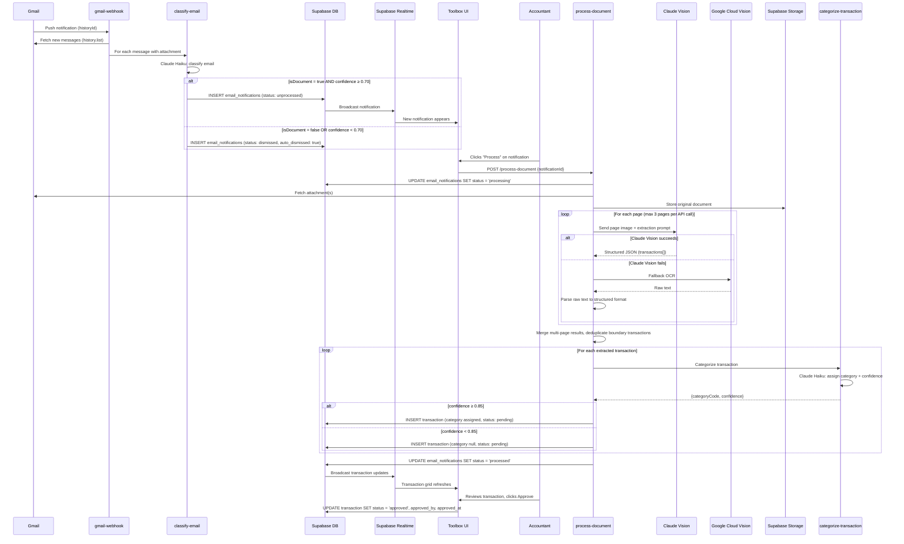
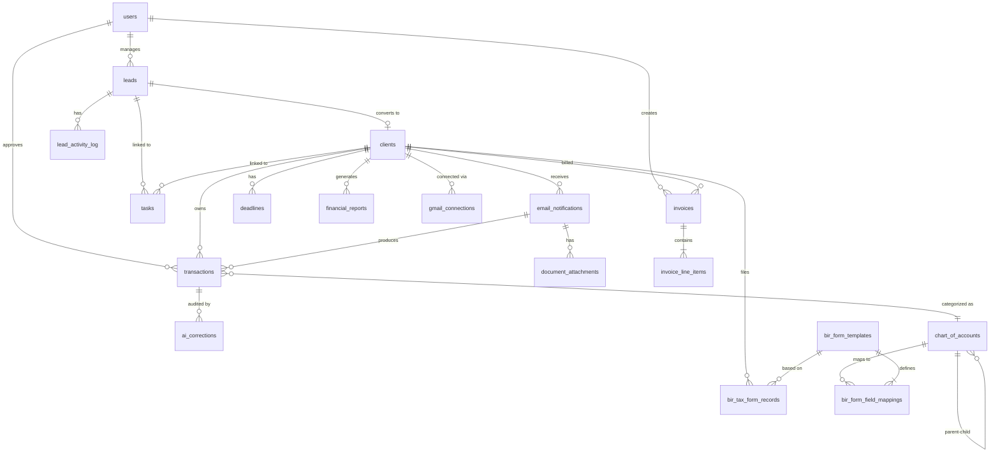
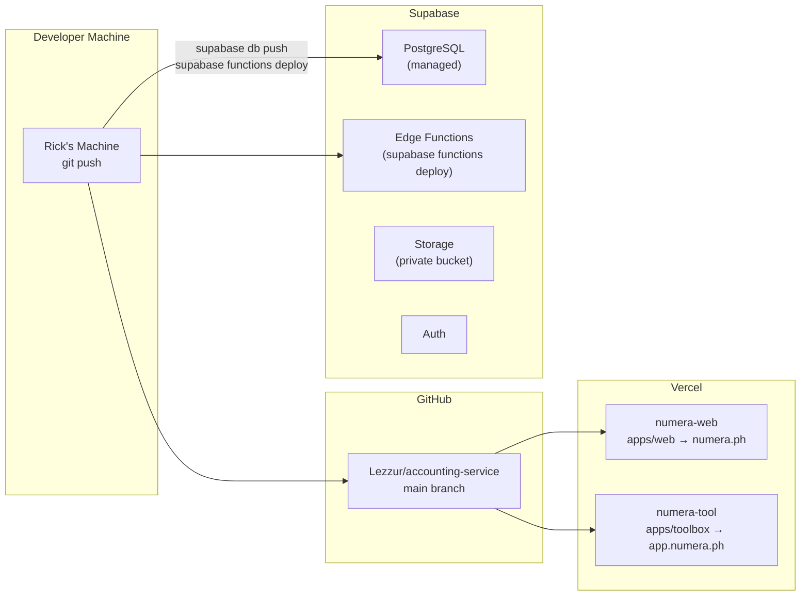
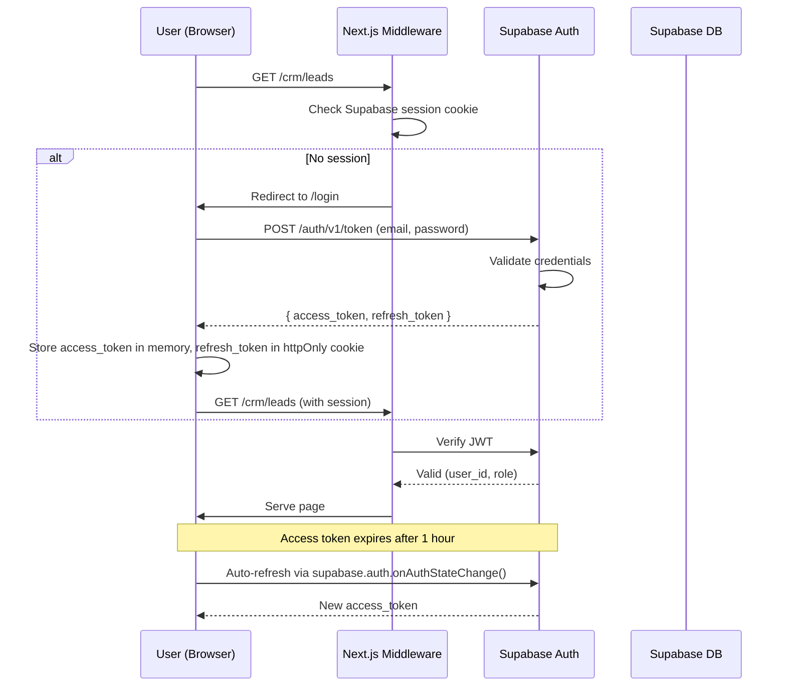
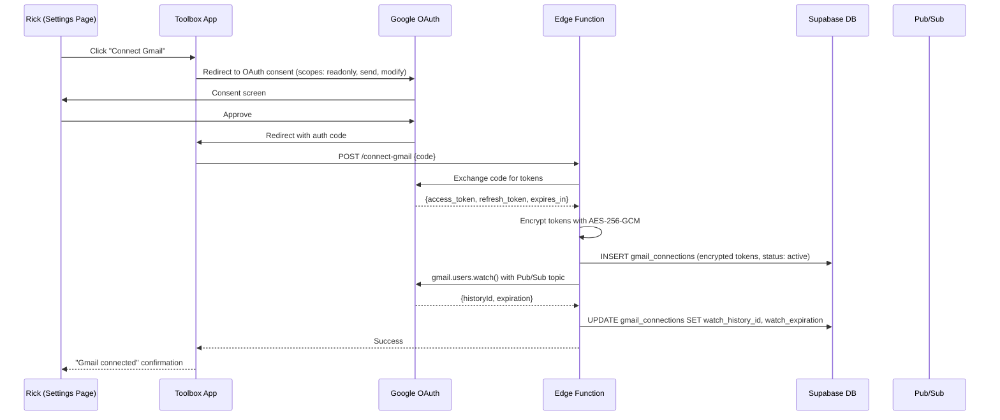

# Numera Accounting Service — Technical Specification

**Author:** Tony Stark (Architecture / Engineering)
**Status:** Draft
**Last Updated:** 2026-04-15
**Reviewers:** Rick (Product Owner / Developer), Lisa Hayes (Coordinator)
**PRD Reference:** PRD-numera-accounting.md (2026-04-15, Reviewed)
**Discovery Reference:** DISCOVERY-accounting-service.md (2026-04-14, Approved)

---

## 1. Overview

Numera is a monorepo web application comprising a public marketing website and an internal Toolbox (CRM + Workdesk) built on Next.js 14+, Supabase (PostgreSQL), and Claude AI APIs. The core technical challenge is the AI-assisted document processing pipeline: Gmail push notifications trigger email classification, Claude Vision extracts structured financial data from document images, and the accountant reviews transactions in a virtualized data grid before generating BIR-compliant tax forms and financial reports via SQL aggregation against the Supabase schema. This spec defines the complete architecture — database schema, AI pipeline, Gmail integration, auth flow, monorepo structure, deployment topology, and failure modes — for a single-tenant system operated by a two-person team (one accountant, one developer).

---

## 2. Context and Background

- **Current system state:** Greenfield. No existing system. The accountant currently uses Excel spreadsheets, manual BIR form preparation, and fragmented email/Viber communication with clients.
- **Problem:** Manual data entry bottlenecks the accountant at 5–8 clients. AI-assisted extraction, categorization, and report generation can scale throughput to 20+ clients without additional hires.
- **Motivation:** Claude Vision and structured output APIs have matured to the point where document parsing accuracy is production-viable for Philippine financial documents. The automation layer is the competitive moat.
- **Constraints:** Solo developer (Rick). Lean budget (free/low-cost tiers). Philippines-only (BIR compliance). Gmail as primary document intake. Single-tenant.
- **Related systems:** Gmail API, Google Sheets API, Google Cloud Vision (fallback OCR), Cal.com (booking), Anthropic Claude API.

---

## 3. Goals and Non-Goals

### Goals
- Design a PostgreSQL schema that enforces financial data integrity via `numeric` types, foreign keys, and constraints — supporting single-entry bookkeeping with derived financial reports
- Specify the complete AI pipeline from Gmail push notification through OCR extraction to approved transaction, with confidence scoring and human review gates
- Define Edge Function contracts for Gmail webhook handling, document processing, report generation, and BIR form pre-filling
- Establish a Turborepo monorepo structure with clear package boundaries for a solo developer
- Design auth, session management, and RLS policies for single-tenant with future multi-tenant capability
- Map every failure mode to detection, fallback, and recovery for all critical paths

### Non-Goals
- Multi-tenant architecture implementation (RLS policies are designed but not activated for tenant isolation)
- Full double-entry accounting engine with balanced journal entries (see Decision D1)
- Client-facing portal or authentication
- Automated BIR e-filing (BIR has no public API)
- Mobile native application
- Real-time collaborative editing

---

## 4. Proposed Architecture

### 4.1 High-Level System Architecture

```mermaid
graph TB
    subgraph "Client Layer"
        WEB["Marketing Website<br/>(apps/web)"]
        TOOL["Toolbox App<br/>(apps/toolbox)"]
    end

    subgraph "Hosting"
        VERCEL_WEB["Vercel Project: numera-web<br/>numera.ph"]
        VERCEL_TOOL["Vercel Project: numera-tool<br/>app.numera.ph"]
    end

    subgraph "Supabase Platform"
        AUTH["Supabase Auth<br/>Email/Password"]
        DB["PostgreSQL<br/>(Managed)"]
        STORAGE["Supabase Storage<br/>(Private Bucket)"]
        REALTIME["Supabase Realtime<br/>(Subscriptions)"]
        
        subgraph "Edge Functions (Deno)"
            EF_GMAIL["gmail-webhook<br/>Push notification handler"]
            EF_CLASSIFY["classify-email<br/>Claude Haiku classification"]
            EF_PROCESS["process-document<br/>Claude Vision extraction"]
            EF_CATEGORIZE["categorize-transaction<br/>Claude Haiku categorization"]
            EF_REPORT["generate-report<br/>SQL aggregation + narrative"]
            EF_BIRFILL["prefill-bir-form<br/>Template field mapping"]
            EF_PDF["render-pdf<br/>HTML → PDF generation"]
            EF_SHEETS["export-sheets<br/>Google Sheets API writer"]
            EF_CONTACT["handle-contact-form<br/>Lead creation"]
            EF_CRON["cron-gmail-watch<br/>Renew Gmail watch()"]
            EF_DEADLINES["cron-generate-deadlines<br/>Annual deadline refresh"]
        end
    end

    subgraph "External APIs"
        GMAIL["Gmail API<br/>(Push + Send)"]
        CLAUDE_H["Claude API<br/>(Haiku — classification)"]
        CLAUDE_S["Claude API<br/>(Sonnet Vision — OCR)"]
        CLAUDE_T["Claude API<br/>(Sonnet — narratives)"]
        GCV["Google Cloud Vision<br/>(OCR fallback)"]
        GSHEETS["Google Sheets API<br/>(Export)"]
        CALCOM["Cal.com<br/>(Booking embed)"]
    end

    WEB --> VERCEL_WEB
    TOOL --> VERCEL_TOOL

    VERCEL_WEB --> EF_CONTACT
    VERCEL_TOOL --> AUTH
    VERCEL_TOOL --> DB
    VERCEL_TOOL --> STORAGE
    VERCEL_TOOL --> REALTIME
    VERCEL_TOOL --> EF_PROCESS
    VERCEL_TOOL --> EF_REPORT
    VERCEL_TOOL --> EF_BIRFILL
    VERCEL_TOOL --> EF_PDF
    VERCEL_TOOL --> EF_SHEETS

    GMAIL -- "Push Notification" --> EF_GMAIL
    EF_GMAIL --> EF_CLASSIFY
    EF_CLASSIFY --> CLAUDE_H
    EF_CLASSIFY --> DB

    EF_PROCESS --> CLAUDE_S
    EF_PROCESS --> GCV
    EF_PROCESS --> STORAGE
    EF_PROCESS --> DB
    EF_PROCESS --> EF_CATEGORIZE
    EF_CATEGORIZE --> CLAUDE_H

    EF_REPORT --> DB
    EF_REPORT --> CLAUDE_T
    EF_BIRFILL --> DB

    EF_PDF --> STORAGE
    EF_SHEETS --> GSHEETS
    EF_CRON --> GMAIL
    EF_CONTACT --> DB
```



### 4.2 Data Flow: Email to Approved Transaction



### 4.3 Component Details

#### Component: Marketing Website (`apps/web`)
- **Responsibility:** Public-facing lead generation. SSR landing page with contact form and Cal.com embed.
- **Technology:** Next.js 14+ App Router, TypeScript, Tailwind CSS, shadcn/ui
- **Interfaces:** Consumes `handle-contact-form` Edge Function. Embeds Cal.com JavaScript widget.
- **Scaling:** Static/ISR pages served from Vercel CDN. Zero server-side compute for static content. Contact form is the only dynamic endpoint.

#### Component: Toolbox Application (`apps/toolbox`)
- **Responsibility:** Internal CRM (lead pipeline, client profiles, tasks, invoicing) and Workdesk (document processing, transaction grid, reports, tax prep, deadlines).
- **Technology:** Next.js 14+ App Router (client-heavy SPA behavior), TypeScript, Tailwind CSS, shadcn/ui, TanStack Table v8 (virtualized data grid)
- **Interfaces:** Supabase client SDK for direct DB reads/writes (via RLS). Supabase Realtime for notification subscriptions. Edge Functions for AI operations and exports.
- **Scaling:** Single-tenant; one active user typical. TanStack Table virtual rows handle 1,000+ transaction rows without DOM bloat.

#### Component: Edge Functions (`supabase/functions/`)
- **Responsibility:** Serverless business logic — Gmail webhooks, AI pipeline orchestration, report generation, PDF rendering, Google Sheets export.
- **Technology:** Deno runtime (Supabase Edge Functions), TypeScript
- **Interfaces:** Invoked by Toolbox via `supabase.functions.invoke()`, by Gmail via HTTPS webhook, and by Supabase cron for scheduled jobs.
- **Scaling:** Serverless auto-scaling. Cold starts typically < 500ms on Deno. Each function is stateless.

#### Component: AI Pipeline (`packages/ai/`)
- **Responsibility:** Shared AI client library. Prompt templates, response schema validation, confidence scoring, retry logic, fallback orchestration.
- **Technology:** TypeScript. Anthropic SDK (`@anthropic-ai/sdk`). Google Cloud Vision client.
- **Interfaces:** Consumed by Edge Functions. Exports typed functions: `classifyEmail()`, `extractDocument()`, `categorizeTransaction()`, `generateNarrative()`, `draftEmail()`.

#### Component: Database Package (`packages/db/`)
- **Responsibility:** Supabase client initialization, generated TypeScript types from schema, migration files, seed data (chart of accounts, BIR form templates).
- **Technology:** TypeScript. `@supabase/supabase-js`. Supabase CLI for migrations.
- **Interfaces:** Consumed by both `apps/web` (contact form), `apps/toolbox` (all CRUD), and Edge Functions (server-side operations).

#### Component: Shared UI (`packages/ui/`)
- **Responsibility:** shadcn/ui components with Numera design tokens. Shared between `apps/web` and `apps/toolbox`.
- **Technology:** React, TypeScript, Tailwind CSS, shadcn/ui, Lucide React icons.
- **Interfaces:** Consumed by both apps. Exports buttons, inputs, cards, badges, toasts, modals, data table primitives, and layout components.

---

### 4.4 Data Model

#### 4.4.1 Entity Relationship Diagram



#### 4.4.2 Schema Definitions

All monetary values use `numeric(15,2)`. All timestamps use `timestamptz`. All IDs use `uuid` with `gen_random_uuid()` default.

---

##### Table: `users`

Internal Toolbox users (accountant + Rick). Managed by Supabase Auth — this table extends `auth.users`.

| Column | Type | Constraints | Description |
|--------|------|-------------|-------------|
| `id` | `uuid` | PK, FK → `auth.users.id` | Supabase Auth user ID |
| `full_name` | `text` | NOT NULL | Display name |
| `role` | `text` | NOT NULL, CHECK (`role` IN ('admin', 'accountant')) | `admin` = Rick, `accountant` = partner |
| `created_at` | `timestamptz` | NOT NULL, DEFAULT `now()` | |
| `updated_at` | `timestamptz` | NOT NULL, DEFAULT `now()` | |

**Indexes:** PK on `id`.

**RLS Policy:**
- SELECT: `auth.uid() = id` (users see own profile)
- UPDATE: `auth.uid() = id` (users edit own profile)
- Admin role can SELECT all (for future multi-user management)

---

##### Table: `leads`

Sales pipeline records. Created from website contact form or manually.

| Column | Type | Constraints | Description |
|--------|------|-------------|-------------|
| `id` | `uuid` | PK, DEFAULT `gen_random_uuid()` | |
| `business_name` | `text` | NOT NULL | |
| `contact_name` | `text` | NOT NULL | |
| `contact_email` | `text` | NOT NULL | |
| `contact_phone` | `text` | | Optional |
| `source` | `text` | NOT NULL, CHECK (`source` IN ('website_form', 'cal_booking', 'referral', 'manual')) | Lead source |
| `stage` | `text` | NOT NULL, DEFAULT 'lead', CHECK (`stage` IN ('lead', 'contacted', 'call_booked', 'proposal_sent', 'negotiation', 'closed_won', 'closed_lost')) | Pipeline stage |
| `notes` | `text` | CHECK (`length(notes) <= 10000`) | Markdown-light notes |
| `created_by` | `uuid` | FK → `users.id` | NULL for website-created leads |
| `created_at` | `timestamptz` | NOT NULL, DEFAULT `now()` | |
| `updated_at` | `timestamptz` | NOT NULL, DEFAULT `now()` | |

**Indexes:**
- `idx_leads_stage` ON `leads(stage)` — filter by pipeline stage
- `idx_leads_created_at` ON `leads(created_at DESC)` — sort by recency
- `idx_leads_source` ON `leads(source)` — filter by source

**RLS Policy:** All authenticated users can CRUD all leads (single-tenant).

---

##### Table: `lead_activity_log`

Immutable audit trail for lead stage changes and edits.

| Column | Type | Constraints | Description |
|--------|------|-------------|-------------|
| `id` | `uuid` | PK, DEFAULT `gen_random_uuid()` | |
| `lead_id` | `uuid` | NOT NULL, FK → `leads.id` ON DELETE CASCADE | |
| `action` | `text` | NOT NULL | e.g., 'stage_changed', 'notes_updated', 'created' |
| `details` | `jsonb` | | e.g., `{"from": "lead", "to": "contacted"}` |
| `performed_by` | `uuid` | FK → `users.id` | NULL for system actions |
| `created_at` | `timestamptz` | NOT NULL, DEFAULT `now()` | |

**Indexes:**
- `idx_lead_activity_lead_id` ON `lead_activity_log(lead_id, created_at DESC)` — activity timeline per lead

**RLS Policy:** All authenticated users can SELECT. INSERT via trigger/Edge Function only.

---

##### Table: `clients`

Active clients converted from leads.

| Column | Type | Constraints | Description |
|--------|------|-------------|-------------|
| `id` | `uuid` | PK, DEFAULT `gen_random_uuid()` | |
| `business_name` | `text` | NOT NULL | |
| `business_type` | `text` | NOT NULL, CHECK (`business_type` IN ('sole_prop', 'opc', 'corporation')) | |
| `tin` | `text` | NOT NULL, CHECK (`tin ~ '^\d{3}-\d{3}-\d{3}(-\d{3})?$'`) | TIN format: `###-###-###` or `###-###-###-###` |
| `registered_address` | `text` | NOT NULL | |
| `industry` | `text` | NOT NULL | From predefined list + "Other" |
| `bir_registration_type` | `text` | NOT NULL, CHECK (`bir_registration_type` IN ('vat', 'non_vat')) | |
| `fiscal_year_start_month` | `smallint` | NOT NULL, CHECK (`fiscal_year_start_month` BETWEEN 1 AND 12) | 1 = January |
| `gmail_address` | `text` | NOT NULL, UNIQUE | Document intake email — one per client |
| `monthly_revenue_bracket` | `text` | NOT NULL, CHECK (`monthly_revenue_bracket` IN ('below_250k', '250k_500k', '500k_1m', '1m_3m', 'above_3m')) | |
| `google_sheet_folder_url` | `text` | | Client's Google Drive folder for exports |
| `status` | `text` | NOT NULL, DEFAULT 'active', CHECK (`status` IN ('active', 'inactive')) | |
| `converted_from_lead_id` | `uuid` | FK → `leads.id` ON DELETE SET NULL | Traceability |
| `created_at` | `timestamptz` | NOT NULL, DEFAULT `now()` | |
| `updated_at` | `timestamptz` | NOT NULL, DEFAULT `now()` | |

**Indexes:**
- `idx_clients_status` ON `clients(status)` — filter active/inactive
- `idx_clients_gmail` ON `clients(gmail_address)` — unique + email lookup during classification
- `idx_clients_business_name` ON `clients(business_name)` — search

**RLS Policy:** All authenticated users can CRUD all clients.

---

##### Table: `gmail_connections`

OAuth token storage for Gmail integration. Encrypted at rest.

| Column | Type | Constraints | Description |
|--------|------|-------------|-------------|
| `id` | `uuid` | PK, DEFAULT `gen_random_uuid()` | |
| `user_id` | `uuid` | NOT NULL, FK → `users.id` | Which Toolbox user connected Gmail |
| `gmail_email` | `text` | NOT NULL, UNIQUE | The connected Gmail address |
| `access_token_encrypted` | `text` | NOT NULL | AES-256-GCM encrypted access token |
| `refresh_token_encrypted` | `text` | NOT NULL | AES-256-GCM encrypted refresh token |
| `token_expires_at` | `timestamptz` | NOT NULL | Access token expiration |
| `watch_expiration` | `timestamptz` | | Gmail `watch()` expiration (max 7 days) |
| `watch_history_id` | `text` | | Last processed historyId from Gmail |
| `status` | `text` | NOT NULL, DEFAULT 'active', CHECK (`status` IN ('active', 'token_expired', 'revoked', 'error')) | |
| `last_error` | `text` | | Last error message if status != active |
| `created_at` | `timestamptz` | NOT NULL, DEFAULT `now()` | |
| `updated_at` | `timestamptz` | NOT NULL, DEFAULT `now()` | |

**Indexes:**
- `idx_gmail_connections_status` ON `gmail_connections(status)` — cron job queries active connections
- `idx_gmail_connections_watch_exp` ON `gmail_connections(watch_expiration)` — renewal scheduling

**RLS Policy:** Only `admin` role can SELECT/UPDATE (Rick manages connections).

**Encryption:** Tokens encrypted using AES-256-GCM with a key stored in Supabase Vault (or environment variable if Vault unavailable on free tier). Decryption occurs only within Edge Functions at runtime. Tokens are never exposed to the client.

---

##### Table: `email_notifications`

Classified emails from the Gmail push notification pipeline.

| Column | Type | Constraints | Description |
|--------|------|-------------|-------------|
| `id` | `uuid` | PK, DEFAULT `gen_random_uuid()` | |
| `gmail_message_id` | `text` | NOT NULL, UNIQUE | Idempotency key — prevents duplicate processing |
| `gmail_thread_id` | `text` | | Thread grouping |
| `client_id` | `uuid` | FK → `clients.id` ON DELETE SET NULL | NULL if sender unmatched |
| `sender_email` | `text` | NOT NULL | |
| `sender_name` | `text` | | Display name from email |
| `subject` | `text` | NOT NULL | |
| `snippet` | `text` | | First ~200 chars of email body |
| `received_at` | `timestamptz` | NOT NULL | Email timestamp |
| `document_type_guess` | `text` | CHECK (`document_type_guess` IN ('receipt', 'bank_statement', 'invoice', 'credit_card_statement', 'expense_report', 'payroll_data', 'other')) | AI classification guess |
| `classification_confidence` | `numeric(3,2)` | CHECK (`classification_confidence` BETWEEN 0 AND 1) | 0.00–1.00 |
| `is_document` | `boolean` | NOT NULL, DEFAULT false | AI classification: is this a client document email? |
| `status` | `text` | NOT NULL, DEFAULT 'unprocessed', CHECK (`status` IN ('unprocessed', 'processing', 'processed', 'failed', 'dismissed')) | |
| `auto_dismissed` | `boolean` | NOT NULL, DEFAULT false | True if AI classified as non-document |
| `processing_error` | `text` | | Error details if status = failed |
| `processing_started_at` | `timestamptz` | | Concurrent processing guard |
| `processed_by` | `uuid` | FK → `users.id` | Who clicked Process |
| `created_at` | `timestamptz` | NOT NULL, DEFAULT `now()` | |
| `updated_at` | `timestamptz` | NOT NULL, DEFAULT `now()` | |

**Indexes:**
- `idx_email_notif_gmail_msg_id` ON `email_notifications(gmail_message_id)` — UNIQUE, idempotency
- `idx_email_notif_status` ON `email_notifications(status)` WHERE `status = 'unprocessed'` — partial index for notification panel
- `idx_email_notif_client_id` ON `email_notifications(client_id, received_at DESC)` — client email history
- `idx_email_notif_received_at` ON `email_notifications(received_at DESC)` — chronological listing

**RLS Policy:** All authenticated users can SELECT. INSERT/UPDATE via Edge Functions with service role key.

---

##### Table: `document_attachments`

Original documents stored in Supabase Storage, linked to email notifications.

| Column | Type | Constraints | Description |
|--------|------|-------------|-------------|
| `id` | `uuid` | PK, DEFAULT `gen_random_uuid()` | |
| `email_notification_id` | `uuid` | NOT NULL, FK → `email_notifications.id` ON DELETE CASCADE | |
| `storage_path` | `text` | NOT NULL | Supabase Storage path in `documents` bucket |
| `original_filename` | `text` | NOT NULL | |
| `mime_type` | `text` | NOT NULL | `application/pdf`, `image/jpeg`, `image/png`, `text/csv` |
| `file_size_bytes` | `integer` | NOT NULL | |
| `page_count` | `smallint` | | For PDFs; NULL for images |
| `created_at` | `timestamptz` | NOT NULL, DEFAULT `now()` | |

**Indexes:**
- `idx_doc_attach_email_notif` ON `document_attachments(email_notification_id)` — lookup by notification

---

##### Table: `chart_of_accounts`

Standard chart of accounts for transaction categorization. Seeded on system init.

| Column | Type | Constraints | Description |
|--------|------|-------------|-------------|
| `id` | `uuid` | PK, DEFAULT `gen_random_uuid()` | |
| `code` | `text` | NOT NULL, UNIQUE | e.g., '1000', '1100', '4000' |
| `name` | `text` | NOT NULL | e.g., 'Cash and Cash Equivalents', 'Revenue' |
| `account_type` | `text` | NOT NULL, CHECK (`account_type` IN ('asset', 'liability', 'equity', 'revenue', 'expense')) | |
| `parent_code` | `text` | FK → `chart_of_accounts.code` | Hierarchy (e.g., '1100' parent of '1110') |
| `normal_balance` | `text` | NOT NULL, CHECK (`normal_balance` IN ('debit', 'credit')) | Debit for assets/expenses, credit for liabilities/equity/revenue |
| `is_active` | `boolean` | NOT NULL, DEFAULT true | Soft-disable without deleting |
| `display_order` | `integer` | NOT NULL, DEFAULT 0 | Sort order within account type |
| `description` | `text` | | Optional description |
| `created_at` | `timestamptz` | NOT NULL, DEFAULT `now()` | |
| `updated_at` | `timestamptz` | NOT NULL, DEFAULT `now()` | |

**Indexes:**
- `idx_coa_code` ON `chart_of_accounts(code)` — UNIQUE, lookup by code
- `idx_coa_account_type` ON `chart_of_accounts(account_type)` — filter by type
- `idx_coa_parent_code` ON `chart_of_accounts(parent_code)` — hierarchy traversal

**Seed Data (excerpt):**
```sql
-- Assets
INSERT INTO chart_of_accounts (code, name, account_type, normal_balance, display_order) VALUES
('1000', 'Assets', 'asset', 'debit', 1),
('1100', 'Cash and Cash Equivalents', 'asset', 'debit', 2),
('1110', 'Cash on Hand', 'asset', 'debit', 3),
('1120', 'Cash in Bank', 'asset', 'debit', 4),
('1200', 'Accounts Receivable', 'asset', 'debit', 5),
('1300', 'Inventory', 'asset', 'debit', 6),
('1400', 'Prepaid Expenses', 'asset', 'debit', 7),
('1500', 'Property and Equipment', 'asset', 'debit', 8),
-- Liabilities
('2000', 'Liabilities', 'liability', 'credit', 20),
('2100', 'Accounts Payable', 'liability', 'credit', 21),
('2200', 'Accrued Expenses', 'liability', 'credit', 22),
('2300', 'Output VAT Payable', 'liability', 'credit', 23),
('2400', 'Income Tax Payable', 'liability', 'credit', 24),
('2500', 'Withholding Tax Payable', 'liability', 'credit', 25),
('2600', 'Loans Payable', 'liability', 'credit', 26),
-- Equity
('3000', 'Equity', 'equity', 'credit', 30),
('3100', 'Owner''s Capital', 'equity', 'credit', 31),
('3200', 'Retained Earnings', 'equity', 'credit', 32),
('3300', 'Owner''s Withdrawals', 'equity', 'debit', 33),
-- Revenue
('4000', 'Revenue', 'revenue', 'credit', 40),
('4100', 'Service Revenue', 'revenue', 'credit', 41),
('4200', 'Sales Revenue', 'revenue', 'credit', 42),
('4300', 'Other Income', 'revenue', 'credit', 43),
-- Expenses
('5000', 'Expenses', 'expense', 'debit', 50),
('5100', 'Cost of Services', 'expense', 'debit', 51),
('5200', 'Salaries and Wages', 'expense', 'debit', 52),
('5300', 'Rent Expense', 'expense', 'debit', 53),
('5400', 'Utilities Expense', 'expense', 'debit', 54),
('5500', 'Office Supplies', 'expense', 'debit', 55),
('5600', 'Transportation', 'expense', 'debit', 56),
('5700', 'Professional Fees', 'expense', 'debit', 57),
('5800', 'Depreciation Expense', 'expense', 'debit', 58),
('5900', 'Bank Charges', 'expense', 'debit', 59),
('5950', 'Interest Expense', 'expense', 'debit', 60),
('5990', 'Miscellaneous Expense', 'expense', 'debit', 61);
```

---

##### Table: `transactions`

Core financial data. Each row is a single-entry transaction categorized to one chart of accounts code. The implicit counterpart is always the bank account (Cash in Bank — code 1120).

| Column | Type | Constraints | Description |
|--------|------|-------------|-------------|
| `id` | `uuid` | PK, DEFAULT `gen_random_uuid()` | |
| `client_id` | `uuid` | NOT NULL, FK → `clients.id` ON DELETE RESTRICT | Never cascade-delete financial data |
| `date` | `date` | NOT NULL | Transaction date from document |
| `description` | `text` | NOT NULL, CHECK (`length(description) <= 255`) | |
| `amount` | `numeric(15,2)` | NOT NULL, CHECK (`amount > 0`) | Always positive; direction determined by `type` |
| `currency` | `text` | NOT NULL, DEFAULT 'PHP' | PHP only in v1 |
| `type` | `text` | NOT NULL, CHECK (`type` IN ('credit', 'debit')) | Credit = money in (revenue, deposits), Debit = money out (expenses, payments) |
| `category_code` | `text` | FK → `chart_of_accounts.code` | NULL if unassigned (low AI confidence or manual entry required) |
| `category_confidence` | `numeric(3,2)` | CHECK (`category_confidence` BETWEEN 0 AND 1) | NULL if manually assigned |
| `source_email_notification_id` | `uuid` | FK → `email_notifications.id` ON DELETE SET NULL | Links to source email |
| `source_document_attachment_id` | `uuid` | FK → `document_attachments.id` ON DELETE SET NULL | Links to specific attachment |
| `status` | `text` | NOT NULL, DEFAULT 'pending', CHECK (`status` IN ('pending', 'in_review', 'approved', 'rejected', 'manual_entry_required')) | |
| `approved_by` | `uuid` | FK → `users.id` | |
| `approved_at` | `timestamptz` | | |
| `rejection_reason` | `text` | | |
| `extraction_batch_id` | `uuid` | | Groups transactions extracted from same multi-page document |
| `extraction_page_number` | `smallint` | | Which page this was extracted from |
| `created_at` | `timestamptz` | NOT NULL, DEFAULT `now()` | |
| `updated_at` | `timestamptz` | NOT NULL, DEFAULT `now()` | |

**Indexes:**
- `idx_txn_client_date` ON `transactions(client_id, date DESC)` — primary query pattern
- `idx_txn_client_status` ON `transactions(client_id, status)` — filter pending/approved
- `idx_txn_status` ON `transactions(status)` WHERE `status IN ('pending', 'in_review', 'manual_entry_required')` — partial index for review queue
- `idx_txn_category_code` ON `transactions(category_code)` — reporting joins
- `idx_txn_source_email` ON `transactions(source_email_notification_id)` — trace to source email
- `idx_txn_client_date_range` ON `transactions(client_id, date, status)` — report generation queries
- `idx_txn_extraction_batch` ON `transactions(extraction_batch_id)` WHERE `extraction_batch_id IS NOT NULL` — multi-page document grouping

**RLS Policy:** All authenticated users can CRUD. Delete restricted to admin role.

**Trigger:** `set_updated_at` — automatically updates `updated_at` on any row modification.

---

##### Table: `ai_corrections`

Audit trail for every edit to an AI-extracted field. First-class table — not an afterthought. This is the mechanism for tracking correction rates and improving prompts over time.

| Column | Type | Constraints | Description |
|--------|------|-------------|-------------|
| `id` | `uuid` | PK, DEFAULT `gen_random_uuid()` | |
| `transaction_id` | `uuid` | NOT NULL, FK → `transactions.id` ON DELETE CASCADE | |
| `field_name` | `text` | NOT NULL | 'date', 'description', 'amount', 'type', 'category_code' |
| `original_value` | `text` | NOT NULL | AI-extracted value (as string) |
| `corrected_value` | `text` | NOT NULL | Accountant's corrected value |
| `corrected_by` | `uuid` | NOT NULL, FK → `users.id` | |
| `correction_source` | `text` | NOT NULL, DEFAULT 'manual', CHECK (`correction_source` IN ('manual', 'bulk_edit')) | |
| `created_at` | `timestamptz` | NOT NULL, DEFAULT `now()` | |

**Indexes:**
- `idx_ai_corrections_txn` ON `ai_corrections(transaction_id)` — corrections per transaction
- `idx_ai_corrections_field` ON `ai_corrections(field_name, created_at DESC)` — correction rate by field
- `idx_ai_corrections_created` ON `ai_corrections(created_at DESC)` — Rick's review dashboard

**RLS Policy:** All authenticated users can INSERT (on edit). SELECT for all. DELETE restricted to admin.

**Usage:** Rick queries this table to compute correction rates:
```sql
-- Overall correction rate for the last 30 days
SELECT
  field_name,
  COUNT(*) as corrections,
  COUNT(DISTINCT transaction_id) as transactions_corrected
FROM ai_corrections
WHERE created_at > now() - interval '30 days'
GROUP BY field_name
ORDER BY corrections DESC;

-- Category correction rate (measures categorization prompt quality)
SELECT
  ac.original_value as ai_category,
  ac.corrected_value as correct_category,
  COUNT(*) as frequency
FROM ai_corrections ac
WHERE ac.field_name = 'category_code'
  AND ac.created_at > now() - interval '30 days'
GROUP BY ac.original_value, ac.corrected_value
ORDER BY frequency DESC;
```

---

##### Table: `invoices`

Client billing invoices.

| Column | Type | Constraints | Description |
|--------|------|-------------|-------------|
| `id` | `uuid` | PK, DEFAULT `gen_random_uuid()` | |
| `invoice_number` | `text` | NOT NULL, UNIQUE | Format: `INV-YYYY-####` (sequential per year) |
| `client_id` | `uuid` | NOT NULL, FK → `clients.id` ON DELETE RESTRICT | |
| `subtotal` | `numeric(15,2)` | NOT NULL | Sum of line item totals |
| `vat_amount` | `numeric(15,2)` | | 12% VAT; only for VAT-registered clients |
| `total_amount` | `numeric(15,2)` | NOT NULL | subtotal + vat_amount |
| `issue_date` | `date` | NOT NULL | |
| `due_date` | `date` | NOT NULL | |
| `status` | `text` | NOT NULL, DEFAULT 'draft', CHECK (`status` IN ('draft', 'sent', 'paid')) | Overdue is derived at read time |
| `sent_at` | `timestamptz` | | |
| `paid_at` | `timestamptz` | | |
| `gmail_message_id` | `text` | | Gmail message ID if sent via system |
| `notes` | `text` | | Optional invoice notes |
| `created_by` | `uuid` | NOT NULL, FK → `users.id` | |
| `created_at` | `timestamptz` | NOT NULL, DEFAULT `now()` | |
| `updated_at` | `timestamptz` | NOT NULL, DEFAULT `now()` | |

**Indexes:**
- `idx_invoices_client` ON `invoices(client_id, issue_date DESC)` — client invoice history
- `idx_invoices_status` ON `invoices(status)` — filter by status
- `idx_invoices_due_date` ON `invoices(due_date)` WHERE `status = 'sent'` — overdue detection
- `idx_invoices_number` ON `invoices(invoice_number)` — UNIQUE, lookup

**Overdue derivation (view or application logic):**
```sql
SELECT *,
  CASE WHEN status = 'sent' AND due_date < CURRENT_DATE THEN true ELSE false END AS is_overdue
FROM invoices;
```

---

##### Table: `invoice_line_items`

Separate table — not embedded JSONB. Line items must be individually queryable, aggregatable, and auditable.

| Column | Type | Constraints | Description |
|--------|------|-------------|-------------|
| `id` | `uuid` | PK, DEFAULT `gen_random_uuid()` | |
| `invoice_id` | `uuid` | NOT NULL, FK → `invoices.id` ON DELETE CASCADE | |
| `description` | `text` | NOT NULL | Service description |
| `quantity` | `numeric(10,2)` | NOT NULL, CHECK (`quantity > 0`) | |
| `unit_price` | `numeric(15,2)` | NOT NULL, CHECK (`unit_price >= 0`) | |
| `line_total` | `numeric(15,2)` | NOT NULL, GENERATED ALWAYS AS (`quantity` * `unit_price`) STORED | Computed column |
| `display_order` | `smallint` | NOT NULL, DEFAULT 0 | Sort order within invoice |
| `created_at` | `timestamptz` | NOT NULL, DEFAULT `now()` | |

**Indexes:**
- `idx_line_items_invoice` ON `invoice_line_items(invoice_id, display_order)` — ordered line items per invoice

**Rationale (Lisa's Point #5):** JSONB column would prevent: individual line item queries, cross-invoice aggregation (e.g., "total billed for bookkeeping services across all clients"), and field-level audit trails. A relational table is the correct model for financial line items.

---

##### Table: `tasks`

Accountant to-dos linked to leads or clients.

| Column | Type | Constraints | Description |
|--------|------|-------------|-------------|
| `id` | `uuid` | PK, DEFAULT `gen_random_uuid()` | |
| `title` | `text` | NOT NULL | |
| `due_date` | `date` | NOT NULL | |
| `linked_entity_type` | `text` | CHECK (`linked_entity_type` IN ('lead', 'client')) | |
| `linked_entity_id` | `uuid` | | FK enforced at application level (polymorphic) |
| `priority` | `text` | NOT NULL, DEFAULT 'medium', CHECK (`priority` IN ('low', 'medium', 'high')) | |
| `status` | `text` | NOT NULL, DEFAULT 'todo', CHECK (`status` IN ('todo', 'in_progress', 'done')) | |
| `created_by` | `uuid` | FK → `users.id` | |
| `created_at` | `timestamptz` | NOT NULL, DEFAULT `now()` | |
| `updated_at` | `timestamptz` | NOT NULL, DEFAULT `now()` | |

**Indexes:**
- `idx_tasks_status_due` ON `tasks(status, due_date)` WHERE `status != 'done'` — open tasks sorted by due date
- `idx_tasks_linked` ON `tasks(linked_entity_type, linked_entity_id)` — tasks per entity

---

##### Table: `deadlines`

Auto-generated BIR and deliverable deadlines per client.

| Column | Type | Constraints | Description |
|--------|------|-------------|-------------|
| `id` | `uuid` | PK, DEFAULT `gen_random_uuid()` | |
| `client_id` | `uuid` | NOT NULL, FK → `clients.id` ON DELETE CASCADE | |
| `deadline_type` | `text` | NOT NULL, CHECK (`deadline_type` IN ('monthly_bookkeeping', 'monthly_vat', 'quarterly_bir', 'quarterly_financials', 'annual_itr', 'annual_financials')) | |
| `due_date` | `date` | NOT NULL | |
| `period_label` | `text` | NOT NULL | e.g., 'January 2026', 'Q1 2026', 'FY 2026' |
| `status` | `text` | NOT NULL, DEFAULT 'upcoming', CHECK (`status` IN ('upcoming', 'in_progress', 'completed')) | Overdue derived at read time |
| `completed_at` | `timestamptz` | | |
| `completed_by` | `uuid` | FK → `users.id` | |
| `notes` | `text` | | |
| `created_at` | `timestamptz` | NOT NULL, DEFAULT `now()` | |
| `updated_at` | `timestamptz` | NOT NULL, DEFAULT `now()` | |

**Indexes:**
- `idx_deadlines_client_due` ON `deadlines(client_id, due_date)` — client deadline timeline
- `idx_deadlines_due_status` ON `deadlines(due_date, status)` WHERE `status != 'completed'` — upcoming deadlines dashboard
- `idx_deadlines_unique` ON `deadlines(client_id, deadline_type, period_label)` UNIQUE — idempotent generation

**Deadline Generation Logic:** On client onboarding, the system generates 12 months of deadlines based on client's `bir_registration_type` and `fiscal_year_start_month`. Annual refresh via `cron-generate-deadlines` Edge Function on January 1.

---

##### Table: `financial_reports`

Metadata for generated reports. Actual report content is rendered on demand from transactions; PDF exports stored in Supabase Storage.

| Column | Type | Constraints | Description |
|--------|------|-------------|-------------|
| `id` | `uuid` | PK, DEFAULT `gen_random_uuid()` | |
| `client_id` | `uuid` | NOT NULL, FK → `clients.id` ON DELETE RESTRICT | |
| `report_type` | `text` | NOT NULL, CHECK (`report_type` IN ('profit_and_loss', 'balance_sheet', 'cash_flow', 'bank_reconciliation', 'ar_ageing', 'ap_ageing', 'general_ledger', 'trial_balance')) | |
| `period_start` | `date` | NOT NULL | |
| `period_end` | `date` | NOT NULL | |
| `ai_narrative` | `text` | | Claude-generated summary text |
| `ai_narrative_approved` | `boolean` | NOT NULL, DEFAULT false | Gate before export |
| `ai_narrative_approved_by` | `uuid` | FK → `users.id` | |
| `ai_narrative_approved_at` | `timestamptz` | | |
| `exported_pdf_path` | `text` | | Supabase Storage path |
| `exported_sheets_url` | `text` | | Google Sheets URL |
| `generated_by` | `uuid` | NOT NULL, FK → `users.id` | |
| `created_at` | `timestamptz` | NOT NULL, DEFAULT `now()` | |

**Indexes:**
- `idx_reports_client_type` ON `financial_reports(client_id, report_type, period_start DESC)` — report history per client

---

##### Table: `bir_form_templates`

BIR form definitions. Data-driven — Rick updates these when BIR changes form layouts. No code deployment needed.

| Column | Type | Constraints | Description |
|--------|------|-------------|-------------|
| `id` | `uuid` | PK, DEFAULT `gen_random_uuid()` | |
| `form_number` | `text` | NOT NULL | e.g., '2550Q', '1701' |
| `version` | `text` | NOT NULL | e.g., '2024-01' (BIR revision identifier) |
| `form_title` | `text` | NOT NULL | e.g., 'Quarterly VAT Return' |
| `applicable_to` | `text[]` | NOT NULL | Array of applicable `bir_registration_type` and/or `business_type` values. e.g., `{'vat'}` or `{'sole_prop', 'opc'}` |
| `is_current` | `boolean` | NOT NULL, DEFAULT true | Only one version per form_number is current |
| `template_layout` | `jsonb` | NOT NULL | Sections, field positions, labels — drives PDF rendering |
| `created_at` | `timestamptz` | NOT NULL, DEFAULT `now()` | |
| `updated_at` | `timestamptz` | NOT NULL, DEFAULT `now()` | |

**Indexes:**
- `idx_bir_templates_form_current` ON `bir_form_templates(form_number)` WHERE `is_current = true` — UNIQUE partial, one current per form

---

##### Table: `bir_form_field_mappings`

Maps chart of accounts categories (and computed expressions) to specific BIR form fields. This is the hard part of tax prep — solved here as structured data, not hardcoded transformers.

| Column | Type | Constraints | Description |
|--------|------|-------------|-------------|
| `id` | `uuid` | PK, DEFAULT `gen_random_uuid()` | |
| `template_id` | `uuid` | NOT NULL, FK → `bir_form_templates.id` ON DELETE CASCADE | |
| `field_code` | `text` | NOT NULL | BIR field identifier on the form (e.g., 'line_20A', 'total_sales') |
| `field_label` | `text` | NOT NULL | Human-readable label |
| `mapping_type` | `text` | NOT NULL, CHECK (`mapping_type` IN ('sum_category', 'sum_account_type', 'computed', 'static', 'client_field')) | How to derive the value |
| `mapping_expression` | `jsonb` | NOT NULL | See mapping types below |
| `is_required` | `boolean` | NOT NULL, DEFAULT false | |
| `is_editable` | `boolean` | NOT NULL, DEFAULT true | Can accountant override? |
| `display_order` | `integer` | NOT NULL | Field position in form |
| `section` | `text` | | Form section grouping |
| `created_at` | `timestamptz` | NOT NULL, DEFAULT `now()` | |

**Mapping Type Expressions:**

```jsonc
// sum_category — Sum transactions for specific account codes in the period
{"category_codes": ["4100", "4200"], "transaction_type": "credit"}
// Result: SUM(amount) WHERE category_code IN ('4100','4200') AND type='credit' AND date BETWEEN period_start AND period_end

// sum_account_type — Sum all transactions for an account type
{"account_type": "revenue", "transaction_type": "credit"}
// Result: SUM(amount) WHERE category_code IN (SELECT code FROM chart_of_accounts WHERE account_type='revenue') AND type='credit'

// computed — Arithmetic on other field values
{"formula": "field:total_sales * 0.12"}
// Result: Evaluate after all referenced fields are computed

// static — Fixed value
{"value": "0.12"}
// Result: Literal "0.12"

// client_field — Pull from client profile
{"field": "tin"}
// Result: clients.tin for the selected client
```

**Indexes:**
- `idx_bir_field_map_template` ON `bir_form_field_mappings(template_id, display_order)` — ordered fields per template

**Rationale (Lisa's Point #4):** A code-defined transformer per form type would require a code deployment every time BIR changes a form. A JSON mapping table makes form updates a data operation — Rick edits rows in Supabase Studio or via an admin UI. The generic execution engine evaluates the mappings against the transactions table at pre-fill time.

---

##### Table: `bir_tax_form_records`

Instances of pre-filled BIR forms for a client and period.

| Column | Type | Constraints | Description |
|--------|------|-------------|-------------|
| `id` | `uuid` | PK, DEFAULT `gen_random_uuid()` | |
| `client_id` | `uuid` | NOT NULL, FK → `clients.id` ON DELETE RESTRICT | |
| `template_id` | `uuid` | NOT NULL, FK → `bir_form_templates.id` | |
| `form_number` | `text` | NOT NULL | Denormalized for convenience |
| `filing_period` | `text` | NOT NULL | e.g., 'Q1-2026', '2026-01' |
| `status` | `text` | NOT NULL, DEFAULT 'draft', CHECK (`status` IN ('draft', 'prefill_pending', 'prefill_complete', 'exported')) | |
| `prefill_data` | `jsonb` | NOT NULL, DEFAULT '{}' | field_code → computed value |
| `manual_overrides` | `jsonb` | NOT NULL, DEFAULT '{}' | field_code → accountant's override value |
| `exported_pdf_path` | `text` | | Supabase Storage path |
| `created_at` | `timestamptz` | NOT NULL, DEFAULT `now()` | |
| `updated_at` | `timestamptz` | NOT NULL, DEFAULT `now()` | |

**Indexes:**
- `idx_bir_records_client` ON `bir_tax_form_records(client_id, form_number, filing_period)` — lookup
- `idx_bir_records_status` ON `bir_tax_form_records(status)` WHERE `status != 'exported'` — in-progress forms

---

##### Table: `system_settings`

Key-value store for configurable thresholds and system parameters. Avoids hardcoded values.

| Column | Type | Constraints | Description |
|--------|------|-------------|-------------|
| `key` | `text` | PK | Setting identifier |
| `value` | `jsonb` | NOT NULL | Setting value |
| `description` | `text` | | Human-readable description |
| `updated_at` | `timestamptz` | NOT NULL, DEFAULT `now()` | |
| `updated_by` | `uuid` | FK → `users.id` | |

**Seed Data:**
```sql
INSERT INTO system_settings (key, value, description) VALUES
('category_confidence_threshold', '0.85', 'Minimum confidence for auto-assigning transaction categories'),
('email_classification_confidence_threshold', '0.70', 'Minimum confidence to surface email as document notification'),
('ocr_low_confidence_threshold', '0.80', 'Below this, flag extracted amount with warning'),
('ai_cost_alert_threshold', '25.00', 'USD amount to trigger cost alert'),
('ai_cost_ceiling', '30.00', 'USD monthly cost ceiling');
```

---

### 4.5 Database Migrations Strategy

Migrations managed via Supabase CLI (`supabase migration new`, `supabase db push`).

**Migration order for initial deploy:**
1. `001_create_users.sql` — users table extending auth.users
2. `002_create_leads.sql` — leads + lead_activity_log
3. `003_create_clients.sql` — clients + gmail_connections
4. `004_create_chart_of_accounts.sql` — chart_of_accounts + seed data
5. `005_create_email_notifications.sql` — email_notifications + document_attachments
6. `006_create_transactions.sql` — transactions + ai_corrections
7. `007_create_invoices.sql` — invoices + invoice_line_items
8. `008_create_tasks.sql` — tasks
9. `009_create_deadlines.sql` — deadlines
10. `010_create_financial_reports.sql` — financial_reports
11. `011_create_bir_templates.sql` — bir_form_templates + bir_form_field_mappings + bir_tax_form_records
12. `012_create_system_settings.sql` — system_settings + seed data
13. `013_create_rls_policies.sql` — all RLS policies
14. `014_create_triggers.sql` — updated_at triggers, lead activity log triggers
15. `015_seed_chart_of_accounts.sql` — full chart of accounts
16. `016_seed_bir_templates.sql` — initial BIR form templates and field mappings

**Backward compatibility:** All migrations are additive. No destructive operations (DROP COLUMN, DROP TABLE) in v1. Schema changes in v1.x will use additive migrations with application-level backward compatibility.

---

### 4.6 API Design

All Toolbox CRUD operations use the Supabase client SDK directly (auto-generated TypeScript types from the schema via `supabase gen types`). Edge Functions are used only for operations that require server-side secrets (AI API keys, Gmail tokens) or server-side compute (PDF rendering, Google Sheets export).

#### Edge Function: `gmail-webhook`

**Purpose:** Receive Gmail push notifications and trigger email classification.

**Trigger:** HTTP POST from Gmail Pub/Sub subscription.

**Request:**
```json
{
  "message": {
    "data": "<base64-encoded JSON>",
    "messageId": "string",
    "publishTime": "ISO 8601"
  },
  "subscription": "projects/PROJECT_ID/subscriptions/SUBSCRIPTION_NAME"
}
```

Decoded `data` payload:
```json
{
  "emailAddress": "accountant@gmail.com",
  "historyId": "12345"
}
```

**Flow:**
1. Decode Pub/Sub message.
2. Fetch `gmail_connections` row for the email address.
3. If no active connection or `historyId` ≤ `watch_history_id`, return 200 (idempotent).
4. Call Gmail `history.list` from last processed `watch_history_id` to current `historyId`.
5. For each new message with attachments:
   a. Check `email_notifications` for existing `gmail_message_id` (idempotent).
   b. Match sender against `clients.gmail_address`.
   c. Invoke `classify-email` with message metadata.
6. Update `gmail_connections.watch_history_id`.
7. Return 200 OK.

**Response:** `200 OK` (always — Gmail Pub/Sub retries on non-2xx)

**Authentication:** Verifies Pub/Sub message signature.

**Timeout:** 30 seconds.

**Idempotency:** Gmail message ID uniqueness constraint in `email_notifications` table prevents duplicate processing.

---

#### Edge Function: `classify-email`

**Purpose:** Classify an email as a client document (or noise) using Claude Haiku.

**Internal invocation** (called by `gmail-webhook`, not directly from client).

**Input:**
```typescript
interface ClassifyEmailInput {
  gmailMessageId: string;
  senderEmail: string;
  senderName: string;
  subject: string;
  snippet: string; // First ~200 chars of body
  hasAttachments: boolean;
  attachmentNames: string[];
  matchedClientId: string | null;
}
```

**Claude Haiku Prompt:**
```
You are an email classifier for an accounting firm. Determine if this email contains
a financial document (receipt, bank statement, invoice, credit card statement,
expense report, or payroll data).

Sender: {senderEmail} ({senderName})
Subject: {subject}
Preview: {snippet}
Attachments: {attachmentNames}
Known client: {yes/no}

Respond in JSON:
{
  "isDocument": boolean,
  "documentType": "receipt" | "bank_statement" | "invoice" | "credit_card_statement" | "expense_report" | "payroll_data" | "other" | null,
  "confidence": 0.0-1.0,
  "reasoning": "brief explanation"
}
```

**Output:** Writes to `email_notifications` table. If `isDocument = true AND confidence ≥ threshold` (default 0.70), status = `unprocessed`. Otherwise, status = `dismissed`, `auto_dismissed = true`.

**Error Handling:**
- Claude API timeout: Log error, create notification with status `unprocessed` and `document_type_guess = null` (let accountant manually decide).
- Claude API 429: Exponential backoff (3 retries: 2s, 4s, 8s). If all fail, same fallback as timeout.
- Malformed JSON response: Log raw response, create notification with null classification (fail-open — better to show a non-document than to miss a real one).

---

#### Edge Function: `process-document`

**Purpose:** Download email attachment, run OCR/extraction via Claude Vision, categorize transactions, write results to DB.

**Request (from Toolbox client):**
```json
{
  "notificationId": "uuid"
}
```

**Authentication:** Requires valid Supabase Auth JWT. Service role key used for DB writes.

**Flow:**
1. Load `email_notifications` row. Verify status is `unprocessed`.
2. Set status = `processing`, `processing_started_at = now()`. (Concurrent guard: if `processing_started_at` is within the last 5 minutes and status = `processing`, reject with 409 Conflict.)
3. Fetch Gmail message attachments using decrypted access token.
4. For each attachment:
   a. Store in Supabase Storage `documents/{client_id}/{year}/{filename}`.
   b. Create `document_attachments` row.
   c. Determine page count (PDFs via pdf-lib; images = 1 page).
5. Process document through Vision API (see Multi-Page Merging Logic below).
6. For each extracted transaction:
   a. Call `categorize-transaction` to assign chart of accounts code.
   b. INSERT into `transactions` table.
7. Set `email_notifications.status = 'processed'`.
8. Return summary.

**Response (200):**
```json
{
  "success": true,
  "transactionsCreated": 5,
  "transactions": [
    {
      "id": "uuid",
      "date": "2026-01-15",
      "description": "BDO ATM Withdrawal",
      "amount": "5000.00",
      "type": "debit",
      "categoryCode": "1110",
      "categoryConfidence": 0.92,
      "status": "pending"
    }
  ]
}
```

**Error Responses:**

| Status | Code | Description | Client Action |
|--------|------|-------------|---------------|
| 400 | `INVALID_NOTIFICATION` | Notification not found or already processed | Refresh notification list |
| 409 | `ALREADY_PROCESSING` | Another request is processing this document | Wait and refresh |
| 422 | `EXTRACTION_FAILED` | Vision API failed on all fallbacks | Transaction created with `manual_entry_required` status |
| 500 | `INTERNAL_ERROR` | Unexpected failure | Retry once |

**Timeout:** 120 seconds (multi-page documents with fallback can take time).

---

#### Multi-Page Document Merging Logic (Lisa's Point #3)

Documents over 3 pages are processed in sequential batches of max 3 pages per Claude Vision call. The merging logic:

1. **Sequential processing:** Pages processed in order (1–3, 4–6, 7–9, 10). Each batch receives context: `"This is pages {N}-{M} of a {total}-page document. Previous page ended with balance: {running_balance}."`

2. **Transaction deduplication at page boundaries:** The last transaction on page N and first transaction on page N+1 may overlap (bank statements commonly repeat the last entry). Deduplication rules:
   - If two transactions have the same `date + amount + description` (fuzzy: Levenshtein distance ≤ 3 on description), keep only the first occurrence.
   - If the running balance from page N matches the opening balance on page N+1, no overlap exists.

3. **Running balance continuity check:** Each Vision extraction includes the running balance (if present on the document). After merging, validate: `opening_balance + sum(credits) - sum(debits) = closing_balance`. If imbalanced, flag the transaction set with a warning (does not block processing).

4. **Batch ID:** All transactions from the same multi-page document share an `extraction_batch_id` (UUID) and have `extraction_page_number` set. This enables the accountant to view all transactions from one document together.

---

#### Edge Function: `categorize-transaction`

**Purpose:** Assign a chart of accounts category to an extracted transaction using Claude Haiku.

**Internal invocation** (called by `process-document`).

**Input:**
```typescript
interface CategorizeInput {
  description: string;
  amount: string;
  type: 'credit' | 'debit';
  clientIndustry: string;
  existingCategories: { code: string; name: string; type: string }[];
  recentCorrections?: { original: string; corrected: string; description: string }[];
}
```

**Claude Haiku Prompt:**
```
You are a transaction categorizer for Philippine SMB bookkeeping. Assign the most
appropriate chart of accounts category.

Transaction:
- Description: {description}
- Amount: ₱{amount}
- Type: {type}
- Client industry: {clientIndustry}

Available categories:
{categories as code: name (type)}

{If recentCorrections exist:}
Recent corrections for similar transactions (learn from these):
{corrections as: "{description}" was "{original}" → corrected to "{corrected}"}

Respond in JSON:
{
  "categoryCode": "string",
  "confidence": 0.0-1.0,
  "reasoning": "brief"
}
```

**Confidence threshold:** Read from `system_settings.category_confidence_threshold` (default 0.85). If confidence < threshold, `category_code` is set to NULL on the transaction and the grid shows a "?" indicator.

**Few-shot learning from corrections:** The prompt includes recent corrections from `ai_corrections` for the same client (up to 10 most recent). This provides implicit fine-tuning without actual model training.

---

#### Edge Function: `generate-report`

**Purpose:** Generate a financial report from approved transactions via SQL aggregation. Optionally generate AI narrative.

**Request:**
```json
{
  "clientId": "uuid",
  "reportType": "profit_and_loss",
  "periodStart": "2026-01-01",
  "periodEnd": "2026-01-31"
}
```

**SQL Generation Logic:**

The report engine executes different SQL queries depending on `reportType`. All queries filter by `client_id`, `date BETWEEN period_start AND period_end`, and `status = 'approved'`.

**Profit & Loss:**
```sql
-- Revenue
SELECT coa.code, coa.name, SUM(t.amount) as total
FROM transactions t
JOIN chart_of_accounts coa ON t.category_code = coa.code
WHERE t.client_id = $1
  AND t.date BETWEEN $2 AND $3
  AND t.status = 'approved'
  AND coa.account_type = 'revenue'
GROUP BY coa.code, coa.name
ORDER BY coa.display_order;

-- Expenses (same structure, account_type = 'expense')
-- Net Income = Total Revenue - Total Expenses
```

**Balance Sheet:**
```sql
-- Assets: Sum of all asset-type transactions up to period_end
SELECT coa.code, coa.name, 
  SUM(CASE WHEN t.type = 'debit' THEN t.amount ELSE -t.amount END) as balance
FROM transactions t
JOIN chart_of_accounts coa ON t.category_code = coa.code
WHERE t.client_id = $1
  AND t.date <= $2  -- Up to period end, not just within period
  AND t.status = 'approved'
  AND coa.account_type = 'asset'
GROUP BY coa.code, coa.name
ORDER BY coa.display_order;

-- Liabilities and Equity: Similar, with appropriate debit/credit logic
-- Retained Earnings = cumulative Net Income from all prior approved transactions
```

**Trial Balance:**
```sql
SELECT coa.code, coa.name, coa.account_type, coa.normal_balance,
  SUM(CASE WHEN t.type = 'debit' THEN t.amount ELSE 0 END) as total_debits,
  SUM(CASE WHEN t.type = 'credit' THEN t.amount ELSE 0 END) as total_credits
FROM transactions t
JOIN chart_of_accounts coa ON t.category_code = coa.code
WHERE t.client_id = $1
  AND t.date BETWEEN $2 AND $3
  AND t.status = 'approved'
GROUP BY coa.code, coa.name, coa.account_type, coa.normal_balance
ORDER BY coa.display_order;

-- Validation: SUM(total_debits) should equal SUM(total_credits)
-- If not, include imbalance warning in response
```

**AI Narrative Generation (P&L and Balance Sheet only):**
After SQL results are computed, pass summarized figures to Claude Sonnet:

```
Generate a brief professional financial summary (3-5 sentences) for a {reportType}
for the period {periodStart} to {periodEnd}.

Key figures:
{formatted report data}

Write in third person. Focus on: revenue trends, major expense categories, net 
income, and any notable items. Do not invent data not provided. Label clearly as
"AI-Generated Summary — Review before sharing with client."
```

**Response:**
```json
{
  "reportId": "uuid",
  "data": {
    "sections": [...],
    "totals": {...},
    "validationWarnings": ["Trial balance out of balance by ₱150.00"]
  },
  "aiNarrative": "string or null",
  "generatedAt": "ISO 8601"
}
```

---

#### Edge Function: `prefill-bir-form`

**Purpose:** Pre-fill a BIR tax form by evaluating field mappings against approved transaction data.

**Request:**
```json
{
  "clientId": "uuid",
  "formNumber": "2550Q",
  "filingPeriod": "Q1-2026"
}
```

**Flow:**
1. Load `bir_form_templates` where `form_number = $1 AND is_current = true`.
2. Load all `bir_form_field_mappings` for the template.
3. For each mapping, evaluate based on `mapping_type`:
   - `sum_category`: Execute SUM query against transactions for the specified category codes and period.
   - `sum_account_type`: Execute SUM query against transactions for all codes of the specified account type.
   - `computed`: Evaluate formula referencing other field values (computed after dependencies).
   - `static`: Return literal value.
   - `client_field`: Fetch field from `clients` table.
4. Build `prefill_data` JSON object: `{field_code: computed_value}`.
5. Create or update `bir_tax_form_records` row.
6. Return pre-filled form data.

**Dependency Resolution for Computed Fields:**
Field formulas can reference other fields (e.g., `tax_due = field:taxable_base * 0.12`). The engine:
1. Topologically sorts fields by dependency.
2. Evaluates non-computed fields first.
3. Evaluates computed fields in dependency order.
4. Detects circular dependencies and errors.

**Response:**
```json
{
  "recordId": "uuid",
  "formNumber": "2550Q",
  "fields": [
    {
      "fieldCode": "total_sales",
      "label": "Total Sales",
      "value": "1250000.00",
      "isEditable": true,
      "isRequired": true,
      "section": "Part III - Tax Due"
    }
  ],
  "warnings": ["Missing data for field 'exempt_sales' — verify manually"]
}
```

---

#### Edge Function: `render-pdf`

**Purpose:** Server-side PDF generation for reports, BIR forms, and invoices.

**Request:**
```json
{
  "type": "report" | "bir_form" | "invoice",
  "id": "uuid"
}
```

**Technology:** Deno + `@react-pdf/renderer` (React-based PDF layout). HTML templates compiled to PDF server-side for consistent cross-browser output.

**Response:** Returns Supabase Storage URL for the generated PDF. File stored at:
- Reports: `exports/{client_id}/reports/{report_type}-{period}.pdf`
- BIR forms: `exports/{client_id}/bir/{form_number}-{period}.pdf`
- Invoices: `exports/{client_id}/invoices/{invoice_number}.pdf`

**Timeout:** 30 seconds.

---

#### Edge Function: `export-sheets`

**Purpose:** Export transaction data or report tables to Google Sheets.

**Request:**
```json
{
  "type": "transactions" | "report",
  "clientId": "uuid",
  "periodStart": "2026-01-01",
  "periodEnd": "2026-01-31",
  "reportId": "uuid | null"
}
```

**Flow:**
1. Fetch client's `google_sheet_folder_url`.
2. If null, return error: "No Google Sheets folder configured."
3. Create new spreadsheet via Google Sheets API in client's folder.
4. Name: `{Type}-{ClientName}-{Period}-{timestamp}`.
5. Write headers and data rows.
6. Format: currency columns as `₱#,##0.00`, date columns as `YYYY-MM-DD`.
7. Return spreadsheet URL.

**Authentication:** Uses Google service account credentials stored in Edge Function environment.

**Timeout:** 60 seconds (large datasets).

---

#### Edge Function: `handle-contact-form`

**Purpose:** Process marketing website contact form submissions. Create lead in CRM.

**Request:**
```json
{
  "name": "string",
  "email": "string",
  "businessName": "string | null",
  "message": "string",
  "website": "string"  // Honeypot field
}
```

**Flow:**
1. If `website` field is non-empty, return 200 OK silently (honeypot caught).
2. Validate: name required, email valid format, message 10–1000 chars.
3. INSERT into `leads` table with `source = 'website_form'`, `stage = 'lead'`.
4. Return success.

**Response (200):**
```json
{ "success": true }
```

**Rate Limiting:** 5 submissions per IP per hour (Vercel Edge Middleware or Supabase rate limit function).

**Authentication:** None (public endpoint). CORS restricted to `numera.ph`.

---

#### Edge Function: `cron-gmail-watch`

**Purpose:** Renew Gmail `watch()` subscriptions before they expire (7-day max).

**Schedule:** Every 6 days (via Supabase cron extension `pg_cron` or external cron trigger).

**Flow:**
1. Query `gmail_connections` WHERE `status = 'active'`.
2. For each connection:
   a. Decrypt refresh token.
   b. If `token_expires_at < now()`, refresh the access token via OAuth2.
   c. Call `gmail.users.watch()` with the accountant's Pub/Sub topic.
   d. Update `watch_expiration` to new expiry.
3. If token refresh fails (revoked):
   a. Set `gmail_connections.status = 'revoked'`.
   b. Log error.
   c. Surface banner in Toolbox: "Gmail connection lost. Reconnect in Settings."

**Error Handling:** If `watch()` renewal fails but token is valid, retry up to 3 times with 60s intervals. If all fail, set `status = 'error'` and `last_error` with details.

---

#### Edge Function: `cron-generate-deadlines`

**Purpose:** Annual deadline refresh. Generate next 12 months of deadlines for all active clients.

**Schedule:** January 1 each year (via pg_cron).

**Flow:**
1. Query all `clients` WHERE `status = 'active'`.
2. For each client, generate deadlines for the next 12 months based on:
   - `bir_registration_type` determines which deadline types apply (e.g., `monthly_vat` only for VAT clients).
   - `fiscal_year_start_month` determines quarterly/annual period boundaries.
3. INSERT with `ON CONFLICT (client_id, deadline_type, period_label) DO NOTHING` — idempotent.

---

## 5. Alternatives Considered

### Decision D1: Single-Entry vs Double-Entry Bookkeeping (Lisa's Point #1)

**Chosen: Single-entry with implicit cash counterpart.**

Each transaction maps to one chart of accounts category. The bank account is the implicit cash ledger. When the accountant records a credit transaction categorized as "Service Revenue," the implicit double-entry is: Cash increases, Revenue increases. The system does not require balanced journal entries.

**Why single-entry:**
- The accountant processes bank statements and receipts — each is a single cash event.
- Forcing double-entry (two-line journal entries that must balance to zero) adds friction with zero value for cash-basis SMB bookkeeping.
- Financial reports derive the double-entry view: P&L sums revenue/expense categories. Balance Sheet computes asset/liability/equity totals. Trial Balance validates total debits = total credits across the chart of accounts.
- This is how QuickBooks Simple Start, Wave, and every cash-basis small business tool works.

**Rejected alternative: Full double-entry journal system.**
- Each "transaction" would become a "journal entry" with 2+ line items that must sum to zero.
- Schema impact: Replace `transactions` table with `journal_entries` + `journal_entry_lines`. Every document extraction must produce balanced entries.
- Problem: The AI would need to determine the counterpart account for every transaction, doubling the classification complexity and error surface. A bank deposit would require the AI to say "Debit Cash ₱10,000, Credit Revenue ₱10,000" instead of just "Credit, ₱10,000, Revenue."
- This adds complexity for proper accrual accounting, which is not how these SMB clients are tracked. If accrual basis is needed in v2, the schema can be extended with a `journal_entries` table that references existing transactions.

### Decision D2: Gmail Token Storage

**Chosen: Encrypted tokens in `gmail_connections` table with AES-256-GCM.**

**Rejected alternative: Store tokens in environment variables.** Doesn't scale to multiple Gmail connections. Can't be rotated without redeployment.

**Rejected alternative: Use Supabase Vault.** Ideal solution but may not be available on free tier. If available, migrate to Vault in v1.1.

### Decision D3: Deployment Topology — Two Vercel Projects (Lisa's Point #6)

**Chosen: Two separate Vercel projects from one Turborepo monorepo.**
- `apps/web` → Vercel project "numera-web" → `numera.ph`
- `apps/toolbox` → Vercel project "numera-tool" → `app.numera.ph`

**Why two projects:**
- Separate subdomains give clean auth boundaries (marketing site has no auth; Toolbox requires login).
- Independent deploy cycles — marketing copy changes don't redeploy the Toolbox.
- Vercel natively supports Turborepo monorepos with root directory configuration per project. Changes to `packages/ui` trigger rebuilds for both projects (Vercel detects shared dependency changes).

**Rejected alternative: Single Vercel project with path-based routing.**
- `numera.ph/` → marketing, `numera.ph/toolbox` → app.
- Problem: Shared cookie domain. Auth middleware complexity increases. Can't configure different caching strategies (marketing = aggressive CDN, toolbox = no-cache for dynamic data).
- Problem: Single deployment means marketing changes and toolbox changes are coupled.

**Rejected alternative: Separate repos.**
- Violates the Turborepo decision from Discovery. Shared packages (ui, db, ai) would require publishing to npm or using workspace links across repos.

### Decision D4: PDF Generation Technology

**Chosen: `@react-pdf/renderer` in Supabase Edge Functions (Deno).**

**Why:** React-based layout language. Shared design tokens from `packages/ui`. Server-side rendering ensures consistent output regardless of accountant's browser. BIR forms require pixel-precise field positioning — a layout engine is necessary.

**Rejected alternative: Puppeteer/Playwright.** Requires headless Chromium, which exceeds Supabase Edge Function memory limits (~150MB). Would need a separate Cloud Run service. Over-engineered for structured document rendering.

**Rejected alternative: Client-side jsPDF.** Inconsistent across browsers. Can't guarantee BIR form field alignment.

**Fallback:** If `@react-pdf/renderer` proves inadequate for complex BIR form layouts, migrate to a dedicated Cloud Run service running Puppeteer. Cost: ~$5/month for low-volume usage.

---

## 6. Security Considerations

### Authentication
- **Method:** Supabase Auth with email/password. Two user accounts: Rick (admin), accountant (accountant).
- **Session management:** Supabase uses JWTs with 1-hour access token TTL and long-lived refresh tokens. Client SDK handles automatic token refresh via `supabase.auth.onAuthStateChange()`.
- **Token storage:** Access token in memory. Refresh token in `httpOnly` cookie (Supabase default PKCE flow).
- **Token refresh:** Supabase client SDK automatically refreshes expired access tokens using the refresh token. If refresh fails (token revoked), user redirected to login.

### Authorization
- **RLS (Row Level Security):** Enabled on all tables. Policies defined per table (see schema section). Single-tenant: all authenticated users access all rows. Policies designed to support future multi-tenant by adding `tenant_id` column and policy filter.
- **Role-based access:** `users.role` column distinguishes `admin` (Rick — full access, system settings, Gmail connections) from `accountant` (CRUD on business data, no system settings).
- **Protected routes:** Next.js middleware on `apps/toolbox` checks Supabase session. Unauthenticated requests redirect to `/login`. No middleware needed on `apps/web` (public).

### Data Protection
- **Encryption in transit:** HTTPS enforced on all endpoints (Vercel and Supabase managed TLS).
- **Encryption at rest:** Supabase PostgreSQL uses disk encryption (managed). Gmail OAuth tokens additionally encrypted at application level (AES-256-GCM) before storage.
- **PII handling:** Client business data (TIN, financial amounts, addresses) is sensitive personal information under the Philippine Data Privacy Act (DPA). Stored only in Supabase PostgreSQL. Not logged to external services beyond the Claude API call (with zero-data-retention enabled).
- **Document storage:** Private Supabase Storage bucket. URLs are signed with expiration (default 1 hour). No public access.

### Input Validation
- **Client-side:** Zod schemas for all form inputs (shared between client and server via `packages/db`).
- **Server-side:** Edge Functions validate all inputs against Zod schemas before processing. SQL injection prevented by Supabase client parameterized queries.
- **AI output validation:** All Claude API responses validated against expected JSON schemas. Malformed responses treated as extraction failures.

### Audit Logging
- `lead_activity_log`: All lead stage changes and edits.
- `ai_corrections`: All accountant edits to AI-extracted fields.
- `transactions.approved_by` / `approved_at`: Approval audit trail.
- `invoices.sent_at` / `gmail_message_id`: Invoice sending audit.
- Supabase Auth logs: Login attempts, session events.

### Secrets Management
- **Supabase project keys:** Stored in Vercel environment variables (per-project).
- **Claude API key:** Stored in Supabase Edge Function secrets (`supabase secrets set`).
- **Gmail OAuth credentials:** Client ID/secret in Edge Function secrets. Tokens in `gmail_connections` table (encrypted).
- **Google Cloud Vision key:** Edge Function secrets.
- **Google Sheets service account:** JSON key in Edge Function secrets.
- **Encryption key (for token encryption):** Supabase Vault or Edge Function secret.
- **Rotation:** API keys rotated annually or on suspected compromise. Gmail refresh tokens rotated automatically by Google's OAuth flow.

### Threat Model

| Vector | Risk | Mitigation |
|--------|------|------------|
| Unauthorized Toolbox access | Credential stuffing, brute force | Supabase Auth rate limiting (5 attempts/15min). Only 2 known accounts. |
| XSS on Toolbox | Malicious content in transaction descriptions | React's default escaping. CSP headers. No `dangerouslySetInnerHTML` on user-provided content. |
| CSRF | State-changing requests from malicious origins | Supabase Auth uses `httpOnly` cookies with `SameSite=Lax`. CORS configured for Toolbox domain only. |
| Gmail token theft via DB breach | Attacker accesses encrypted tokens | Tokens encrypted with AES-256-GCM. Key in separate secret store. Useless without decryption key. |
| Contact form spam | Bot submissions | Honeypot field. Rate limiting (5/IP/hour). No CAPTCHA in v1 (adds friction). Monitor spam rate; add Turnstile if needed. |
| AI prompt injection via document content | Malicious text in uploaded documents | AI prompts use system role with strict output schema. No tool-use or code execution enabled. Malformed responses rejected. |

---

## 7. Performance and Scalability

### Latency Targets

| Operation | p50 | p95 | p99 |
|-----------|-----|-----|-----|
| Marketing page load (LCP) | < 1.5s | < 2.5s | < 3.0s |
| Toolbox page load (LCP) | < 2.0s | < 3.0s | < 4.0s |
| Transaction grid render (1,000 rows) | < 50ms | < 100ms | < 200ms |
| Supabase CRUD (single row) | < 50ms | < 100ms | < 200ms |
| Email classification | < 3s | < 5s | < 10s |
| Document processing (1 page) | < 15s | < 25s | < 30s |
| Document processing (10 pages) | < 45s | < 55s | < 60s |
| Report generation (P&L, < 500 txns) | < 2s | < 4s | < 5s |
| BIR form pre-fill | < 2s | < 4s | < 5s |
| PDF render | < 3s | < 5s | < 10s |

### Throughput Targets

| Timeframe | Metric | Target |
|-----------|--------|--------|
| Launch | Active clients | 5 |
| 6 months | Active clients | 10–15 |
| 12 months | Active clients | 15–20 |
| Monthly | Transactions processed | 200–1,000 |
| Monthly | Emails classified | 100–400 |
| Monthly | Reports generated | 15–60 |

### Resource Estimates

- **Supabase PostgreSQL:** < 500MB storage at 20 clients (transactions + documents metadata). Free tier limit: 500MB.
- **Supabase Storage:** < 2GB document storage at 20 clients (primarily PDFs and images). Free tier limit: 1GB. Upgrade to Pro ($25/month) at ~10 clients.
- **Vercel:** < 100K function invocations/month. Free tier limit: 100K.
- **Claude API:** < $10/month at 20 clients (see PRD cost model).
- **Google Cloud Vision:** < $5/month (fallback only; used when Claude Vision fails).

### Scaling Strategy

Single-tenant, 2-person team. Scale concerns are minimal for v1. Architecture decisions that support future scale:

- **Database:** Supabase managed PostgreSQL handles 100K+ rows trivially. Indexes designed for primary query patterns.
- **Edge Functions:** Serverless auto-scaling. No provisioning.
- **Client-side:** TanStack Table virtual rows render only visible rows. No DOM bloat at 10,000+ transactions.
- **Document processing:** Async (user clicks Process, sees spinner, waits). No blocking main thread.

### Caching Strategy

- **Marketing site:** Vercel ISR with 1-hour revalidation. Static assets cached at CDN edge.
- **Toolbox:** No application-level caching in v1. Supabase queries are fast enough for the expected volume. If needed, cache chart of accounts and BIR templates in React Query with 24-hour stale time.
- **AI narrative caching:** Same client + report type + period = cached narrative. Invalidated when transactions in that period change.

---

## 8. Reliability and Failure Handling

### Dependency Failure Matrix

| Dependency | Failure Mode | Detection | Fallback | Recovery | User Experience |
|-----------|-------------|-----------|----------|----------|-----------------|
| Supabase PostgreSQL | Connection timeout | Health check / SDK error | N/A (critical) | Auto-reconnect by SDK | "Service temporarily unavailable. Retrying…" |
| Supabase PostgreSQL | Full outage | Supabase status page / all queries fail | N/A (critical) | Wait for Supabase recovery | Full-page error: "System is under maintenance." |
| Claude API (Haiku) | Timeout > 10s | Edge Function timeout | Create notification with null classification (fail-open) | Auto-retry next email | Notification appears without document type label |
| Claude API (Haiku) | Rate limit (429) | HTTP 429 response | Exponential backoff: 2s, 4s, 8s | Auto-retry | Processing delayed; user sees spinner |
| Claude API (Sonnet Vision) | Timeout > 30s | Edge Function timeout | Fallback to Google Cloud Vision | Auto on next attempt | Toast: "Trying backup processing…" |
| Claude API (Sonnet Vision) | Full outage (5xx) | HTTP 5xx | Google Cloud Vision fallback | Monitor Anthropic status | Toast: "Using backup document scanner." |
| Google Cloud Vision | Outage | API error | Create blank transaction, status = manual_entry_required | N/A | Toast: "Document could not be processed. Please enter manually." |
| Gmail API | Push notification delay | No new notifications for > 1 hour | N/A (notifications delayed, not lost) | Gmail delivers eventually | Banner: "Email sync may be delayed." |
| Gmail API | Token revoked | 401 response on any Gmail call | Set connection status = revoked | User reconnects Gmail in Settings | Banner: "Gmail disconnected. Reconnect in Settings." |
| Gmail API | Rate limit | HTTP 429 | Exponential backoff | Auto-retry | Email processing delayed |
| Google Sheets API | Outage | API error | PDF export still available | Retry button | Toast: "Sheets export failed. Export as PDF instead." |
| Vercel | CDN/edge outage | Cloudflare monitoring | N/A (critical) | Wait for Vercel recovery | Site unreachable |
| Cal.com | Script blocked/unavailable | Widget load timeout (5s) | Fallback text: "Booking unavailable. Use contact form." | N/A | Fallback message in widget area |

### SLOs

| Metric | Target | Measurement | Alert Threshold |
|--------|--------|-------------|----------------|
| Toolbox availability | 99.5% | Uptime check (every 5 min) | < 99% for 1 hour |
| Transaction write success rate | 99.9% | DB insert success / attempts | > 0.5% error rate |
| Document processing success rate | ≥ 90% | Processed / (Processed + Failed) | < 85% |
| Email classification latency | < 10s (p95) | Edge Function duration | > 15s |
| AI cost per month | < $30 | Anthropic usage dashboard | > $25 |

### Disaster Recovery

- **RPO (Recovery Point Objective):** < 1 hour. Supabase provides continuous backups (point-in-time recovery on Pro plan). Free tier has daily backups.
- **RTO (Recovery Time Objective):** < 4 hours. Supabase-managed recovery. No custom DR infrastructure.
- **Backup strategy:** Supabase automated backups (daily on free tier, PITR on Pro). Document attachments in Supabase Storage (replicated by Supabase). No additional backup needed at launch.
- **Data export:** Monthly manual export of full database via `pg_dump` as additional safety net. Stored in Google Drive.

---

## 9. Observability

### Logging

- **Log format:** Structured JSON via Edge Function `console.log()`. Supabase aggregates Edge Function logs.
- **Log levels:** `info` (normal operations), `warn` (degraded but functional — e.g., fallback to GCV), `error` (failed operations requiring attention).
- **Key events logged:**
  - Email classified (message ID, client ID, classification result, confidence)
  - Document processing started/completed/failed (notification ID, page count, duration, model used)
  - Transaction created (ID, source, category confidence)
  - Transaction approved/rejected (ID, user ID)
  - Report generated (type, client, period, duration)
  - BIR form pre-filled (form number, client, period)
  - Gmail token refreshed / watch renewed
  - Auth events (login, logout, failed login)
- **PII in logs:** Transaction amounts and descriptions are logged (needed for debugging). Client TINs, email addresses, and document content are NOT logged. Supabase Storage paths are logged (not file content).

### Metrics

| Metric | Type | Labels | Purpose |
|--------|------|--------|---------|
| `document_processing_duration_seconds` | Histogram | model (claude/gcv), page_count | Track OCR latency |
| `email_classification_duration_seconds` | Histogram | result (document/dismissed) | Track classification latency |
| `ai_api_calls_total` | Counter | model, endpoint, status | Track API usage and errors |
| `ai_corrections_total` | Counter | field_name | Track correction rate |
| `transactions_total` | Counter | status, source (ai/manual) | Track volume and approval rates |
| `edge_function_duration_seconds` | Histogram | function_name, status | Track function performance |
| `edge_function_errors_total` | Counter | function_name, error_type | Track error rates |

**Implementation:** Metrics tracked via Supabase Edge Function logs. Rick builds a simple admin dashboard in Toolbox (admin-only route) that queries these aggregates. No external metrics service in v1.

### Alerts

| Alert | Condition | Severity | Response |
|-------|-----------|----------|----------|
| Gmail connection lost | `gmail_connections.status` changes to 'revoked' or 'error' | Critical | Rick reconnects Gmail OAuth |
| AI cost approaching ceiling | Monthly spend > $25 | Warning | Rick reviews usage patterns |
| Document processing failure rate | > 15% in 24-hour window | Warning | Rick reviews Edge Function logs, checks API status |
| Supabase storage > 80% | Storage usage query | Warning | Upgrade to Pro plan or archive old documents |
| Edge Function error spike | > 5 errors in 15 minutes | Critical | Rick investigates immediately |

**Alert delivery in v1:** Supabase webhook → Edge Function → email notification to Rick. Future: Slack or PagerDuty integration.

---

## 10. Testing Strategy

### Unit Tests
- **Coverage target:** ≥ 80% on `packages/ai` (prompt construction, response parsing, confidence scoring), `packages/db` (type guards, validation schemas).
- **Framework:** Vitest (fast, ESM-native, Turborepo-compatible).
- **What's tested:**
  - AI response schema validation (valid/invalid/malformed JSON)
  - Confidence threshold logic
  - BIR field mapping evaluation engine
  - Report SQL query builders
  - Invoice number generation
  - Deadline generation logic
  - TIN format validation
  - Amount formatting (₱ with commas, 2dp)

### Integration Tests
- **Scope:** Edge Function → Supabase DB round-trips. Gmail webhook → classification → notification creation.
- **Framework:** Vitest + Supabase local dev (`supabase start` spins up local PostgreSQL + Auth + Storage).
- **What's tested:**
  - Contact form submission → lead created in DB
  - Document processing → transactions written with correct foreign keys
  - Report generation → correct SQL aggregation results
  - BIR form pre-fill → correct field mapping evaluation
  - Deadline generation → idempotent (no duplicates)
  - RLS policies → unauthenticated requests blocked, role restrictions enforced

### Contract Tests
- **AI API contracts:** Snapshot tests for Claude API prompt/response schemas. If Anthropic changes response format, tests fail immediately.
- **Supabase types:** Generated TypeScript types re-generated on each schema change. Type errors in consuming code caught at compile time.

### Load Tests
- Not required for v1 launch (< 5 clients, < 1,000 transactions/month). Planned for when client count > 15.
- **Tool:** k6 (scriptable, OSS).
- **Scenario:** Simulate 20 concurrent transaction grid loads with 1,000 rows each.

### Manual QA
- **Gmail push notification → full pipeline:** Send test email with receipt attachment → verify classification → verify extraction → verify transaction in grid.
- **BIR form pre-fill accuracy:** Compare pre-filled values against manually calculated values for a known dataset.
- **PDF rendering:** Visual inspection of generated PDFs for BIR forms (field alignment), reports (formatting), and invoices (branding).
- **Mobile responsiveness:** Marketing site on iPhone 12/13 and Samsung Galaxy S21 (BrowserStack or real devices).

---

## 11. Deployment and Rollout

### Deployment Architecture



### Deployment Pipeline

1. **Code push to `main` branch on GitHub.**
2. **Vercel auto-deploys both projects:**
   - Turborepo detects which apps are affected by the change.
   - If only `apps/web` changed, only numera-web deploys.
   - If `packages/ui` changed, both apps deploy.
   - Preview deployments on PRs (Vercel default).
3. **Supabase schema migrations:** Run manually by Rick via `supabase db push` (v1). Future: CI/CD integration via GitHub Actions.
4. **Edge Functions:** Deployed via `supabase functions deploy --project-ref <ref>` from the monorepo root. All functions deployed together (Supabase CLI behavior).
5. **Secrets:** Set once via `supabase secrets set` and Vercel environment variables. Not in repo.

### Migration Plan (Initial Deploy)

| Step | Action | Risk | Verification |
|------|--------|------|-------------|
| 1 | Create Supabase project | None | Dashboard shows project |
| 2 | Run all migrations (001–016) | Schema errors | `supabase db push` succeeds; tables visible in Studio |
| 3 | Seed chart of accounts and BIR templates | Bad data | Query counts match expected |
| 4 | Deploy Edge Functions | Deploy failure | `supabase functions list` shows all functions |
| 5 | Set all secrets (API keys, OAuth creds) | Missing secret | Each function invocable without auth errors |
| 6 | Create Vercel projects (web + toolbox) | Build failure | Preview URLs accessible |
| 7 | Configure custom domains | DNS propagation | `curl -I numera.ph` returns 200 |
| 8 | Create Supabase Auth users (Rick + accountant) | Auth config | Login succeeds on app.numera.ph |
| 9 | Connect Gmail account | OAuth flow | `gmail_connections` row created with active status |
| 10 | Set up Gmail Pub/Sub topic + subscription | Pub/Sub config | Test email triggers webhook |
| 11 | Send test email with receipt → verify full pipeline | Pipeline bug | Transaction appears in grid |

### Rollout Strategy

- **Method:** Direct deploy (no canary, no feature flags in v1). Single-tenant, 2 users. Complexity of canary deployment exceeds benefit.
- **Pre-launch checklist:**
  - All migrations run without error
  - Edge Functions all responding
  - Gmail webhook receiving notifications
  - Auth working for both accounts
  - Test email → transaction pipeline end-to-end
  - Marketing site loads in < 2.5s on mobile
  - Contact form creates lead
- **Rollback trigger:** Any critical path failure (auth broken, transactions not writing, Edge Functions crashing).
- **Rollback procedure:**
  - Vercel: Instant rollback to previous deployment via Vercel dashboard (one click).
  - Supabase migrations: Run reverse migration SQL (each migration file should have a rollback section). In practice, additive-only migrations mean rollback = deploy previous code that ignores new columns.
  - Edge Functions: Re-deploy previous version from git.

### Environment Configuration

| Environment | Purpose | URL |
|-------------|---------|-----|
| Local | Development | `localhost:3000` (web), `localhost:3001` (toolbox), `localhost:54321` (Supabase local) |
| Preview | PR review | `*.vercel.app` (auto-generated) |
| Production | Live | `numera.ph` (web), `app.numera.ph` (toolbox) |

---

## 12. Monorepo Structure

```
accounting-service/
├── apps/
│   ├── web/                          # Marketing website
│   │   ├── app/                      # Next.js App Router pages
│   │   │   ├── layout.tsx            # Root layout (Inter font, metadata)
│   │   │   ├── page.tsx              # Landing page (hero, services, how it works, contact, cal.com, footer)
│   │   │   └── globals.css           # Tailwind base + website design tokens
│   │   ├── components/               # Website-specific components
│   │   │   ├── nav-bar.tsx
│   │   │   ├── hero-section.tsx
│   │   │   ├── services-section.tsx
│   │   │   ├── how-it-works.tsx
│   │   │   ├── contact-form.tsx
│   │   │   ├── cal-embed.tsx
│   │   │   └── footer.tsx
│   │   ├── next.config.ts
│   │   ├── tailwind.config.ts        # Extends shared config with website tokens
│   │   ├── tsconfig.json
│   │   └── package.json
│   │
│   └── toolbox/                      # CRM + Workdesk application
│       ├── app/
│       │   ├── layout.tsx            # Root layout (auth check, sidebar shell)
│       │   ├── login/
│       │   │   └── page.tsx          # Login page
│       │   ├── crm/
│       │   │   ├── layout.tsx        # CRM module layout
│       │   │   ├── leads/
│       │   │   │   └── page.tsx      # Kanban board
│       │   │   ├── clients/
│       │   │   │   ├── page.tsx      # Client list
│       │   │   │   └── [id]/
│       │   │   │       └── page.tsx  # Client profile
│       │   │   ├── tasks/
│       │   │   │   └── page.tsx      # Task tracker
│       │   │   └── invoices/
│       │   │       └── page.tsx      # Invoice list + create
│       │   ├── workdesk/
│       │   │   ├── layout.tsx        # Workdesk module layout (notification panel)
│       │   │   ├── transactions/
│       │   │   │   └── page.tsx      # Transaction data grid
│       │   │   ├── reports/
│       │   │   │   └── page.tsx      # Report generator
│       │   │   ├── tax-prep/
│       │   │   │   └── page.tsx      # BIR form preparation
│       │   │   └── deadlines/
│       │   │       └── page.tsx      # Deadline tracker
│       │   └── settings/
│       │       └── page.tsx          # Gmail connection, system settings (admin only)
│       ├── components/               # Toolbox-specific components
│       │   ├── sidebar.tsx
│       │   ├── notification-panel.tsx
│       │   ├── transaction-grid.tsx
│       │   ├── document-preview.tsx
│       │   ├── report-viewer.tsx
│       │   ├── bir-form-editor.tsx
│       │   ├── lead-card.tsx
│       │   ├── lead-detail-drawer.tsx
│       │   ├── client-profile-form.tsx
│       │   ├── invoice-form.tsx
│       │   └── deadline-calendar.tsx
│       ├── hooks/                    # Custom React hooks
│       │   ├── use-supabase.ts       # Supabase client hook
│       │   ├── use-realtime.ts       # Realtime subscription hook
│       │   └── use-auth.ts           # Auth state hook
│       ├── lib/
│       │   ├── supabase-browser.ts   # Browser Supabase client
│       │   └── supabase-server.ts    # Server component Supabase client
│       ├── middleware.ts             # Auth middleware (redirect to /login if unauthenticated)
│       ├── next.config.ts
│       ├── tailwind.config.ts        # Extends shared config with toolbox tokens
│       ├── tsconfig.json
│       └── package.json
│
├── packages/
│   ├── ui/                           # Shared component library
│   │   ├── src/
│   │   │   ├── components/           # shadcn/ui components with Numera tokens
│   │   │   │   ├── button.tsx
│   │   │   │   ├── input.tsx
│   │   │   │   ├── card.tsx
│   │   │   │   ├── badge.tsx
│   │   │   │   ├── toast.tsx
│   │   │   │   ├── modal.tsx
│   │   │   │   ├── drawer.tsx
│   │   │   │   ├── dropdown-menu.tsx
│   │   │   │   ├── select.tsx
│   │   │   │   ├── data-table.tsx    # TanStack Table wrapper with virtual rows
│   │   │   │   └── ...
│   │   │   └── index.ts
│   │   ├── tailwind.config.ts        # Base design tokens (shared)
│   │   ├── tsconfig.json
│   │   └── package.json
│   │
│   ├── db/                           # Database layer
│   │   ├── src/
│   │   │   ├── client.ts             # Supabase client factory
│   │   │   ├── types.ts              # Generated types (supabase gen types)
│   │   │   ├── schemas/              # Zod validation schemas
│   │   │   │   ├── lead.ts
│   │   │   │   ├── client.ts
│   │   │   │   ├── transaction.ts
│   │   │   │   ├── invoice.ts
│   │   │   │   ├── task.ts
│   │   │   │   └── ...
│   │   │   └── index.ts
│   │   ├── tsconfig.json
│   │   └── package.json
│   │
│   └── ai/                           # AI pipeline library
│       ├── src/
│       │   ├── client.ts             # Anthropic SDK client factory
│       │   ├── classify-email.ts     # Email classification prompt + parser
│       │   ├── extract-document.ts   # Document OCR prompt + parser + multi-page merge
│       │   ├── categorize.ts         # Transaction categorization prompt + parser
│       │   ├── narrative.ts          # Report narrative generation
│       │   ├── draft-email.ts        # Follow-up email drafting
│       │   ├── fallback-gcv.ts       # Google Cloud Vision fallback
│       │   ├── schemas/              # Response validation schemas (Zod)
│       │   │   ├── classification.ts
│       │   │   ├── extraction.ts
│       │   │   └── categorization.ts
│       │   └── index.ts
│       ├── tsconfig.json
│       └── package.json
│
├── supabase/
│   ├── config.toml                   # Supabase project config
│   ├── migrations/                   # PostgreSQL migrations (001–016)
│   │   ├── 001_create_users.sql
│   │   ├── ...
│   │   └── 016_seed_bir_templates.sql
│   ├── functions/                    # Edge Functions
│   │   ├── gmail-webhook/
│   │   │   └── index.ts
│   │   ├── classify-email/
│   │   │   └── index.ts
│   │   ├── process-document/
│   │   │   └── index.ts
│   │   ├── categorize-transaction/
│   │   │   └── index.ts
│   │   ├── generate-report/
│   │   │   └── index.ts
│   │   ├── prefill-bir-form/
│   │   │   └── index.ts
│   │   ├── render-pdf/
│   │   │   └── index.ts
│   │   ├── export-sheets/
│   │   │   └── index.ts
│   │   ├── handle-contact-form/
│   │   │   └── index.ts
│   │   ├── cron-gmail-watch/
│   │   │   └── index.ts
│   │   └── cron-generate-deadlines/
│   │       └── index.ts
│   └── seed.sql                      # Dev seed data
│
├── turbo.json                        # Turborepo pipeline config
├── package.json                      # Root workspace config
├── pnpm-workspace.yaml               # pnpm workspace definition
├── .env.example                      # Environment variable template
├── .gitignore
└── README.md
```

### Turborepo Pipeline Configuration

```json
{
  "$schema": "https://turbo.build/schema.json",
  "globalDependencies": [".env"],
  "pipeline": {
    "build": {
      "dependsOn": ["^build"],
      "outputs": [".next/**", "dist/**"]
    },
    "dev": {
      "cache": false,
      "persistent": true
    },
    "lint": {
      "dependsOn": ["^build"]
    },
    "test": {
      "dependsOn": ["^build"]
    },
    "type-check": {
      "dependsOn": ["^build"]
    }
  }
}
```

---

## 13. Auth Flow

### Login Flow



### Session Management

- **Access token TTL:** 1 hour (Supabase default).
- **Refresh token TTL:** 30 days (configurable in Supabase dashboard).
- **Token refresh:** Automatic via Supabase client SDK. `onAuthStateChange` listener in root layout detects token expiry and refreshes silently.
- **Session persistence:** Refresh token in `httpOnly` cookie survives page reloads. Access token in memory is re-derived from refresh token on page load.
- **Logout:** Calls `supabase.auth.signOut()` which invalidates the refresh token server-side and clears the cookie. Redirect to `/login`.
- **Forced logout:** If refresh fails (token revoked by admin), client redirects to `/login` with a "Session expired" message.

### Protected Route Pattern

```typescript
// apps/toolbox/middleware.ts
import { createServerClient } from '@supabase/ssr'
import { NextResponse, type NextRequest } from 'next/server'

export async function middleware(request: NextRequest) {
  const response = NextResponse.next()
  
  const supabase = createServerClient(
    process.env.NEXT_PUBLIC_SUPABASE_URL!,
    process.env.NEXT_PUBLIC_SUPABASE_ANON_KEY!,
    { cookies: { /* cookie helpers */ } }
  )

  const { data: { session } } = await supabase.auth.getSession()

  if (!session && !request.nextUrl.pathname.startsWith('/login')) {
    return NextResponse.redirect(new URL('/login', request.url))
  }

  if (session && request.nextUrl.pathname.startsWith('/login')) {
    return NextResponse.redirect(new URL('/crm/leads', request.url))
  }

  // Admin-only routes
  if (request.nextUrl.pathname.startsWith('/settings')) {
    const { data: user } = await supabase
      .from('users')
      .select('role')
      .eq('id', session?.user.id)
      .single()
    
    if (user?.role !== 'admin') {
      return NextResponse.redirect(new URL('/crm/leads', request.url))
    }
  }

  return response
}

export const config = {
  matcher: ['/((?!_next/static|_next/image|favicon.ico).*)'],
}
```

---

## 14. Gmail Integration Architecture (Lisa's Point #2)

### OAuth Setup

1. **Google Cloud project:** Create project with Gmail API enabled.
2. **OAuth consent screen:** Internal use (or external with limited users). Scopes: `gmail.readonly`, `gmail.send`, `gmail.modify`.
3. **OAuth credentials:** Web application client ID + secret. Redirect URI: `https://app.numera.ph/settings/gmail/callback`.
4. **Pub/Sub topic:** Create topic `projects/{project}/topics/gmail-notifications`. Grant Gmail publish permissions.

### Connection Flow



### Token Lifecycle

| Event | Trigger | Action |
|-------|---------|--------|
| Access token expires | Every ~1 hour | Edge Function detects 401, refreshes using `refresh_token` via Google OAuth2 endpoint. Updates `gmail_connections.access_token_encrypted` and `token_expires_at`. |
| Watch subscription expires | Every 7 days max | `cron-gmail-watch` Edge Function runs every 6 days. Calls `gmail.users.watch()` for each active connection. Updates `watch_expiration`. |
| Refresh token revoked | User revokes app access in Google Account | Any Gmail API call returns 401 with `invalid_grant`. Edge Function sets `status = 'revoked'`. Toolbox shows banner: "Gmail disconnected." |
| Refresh token rotated | Google rotates refresh token on use | Edge Function stores new refresh token from the refresh response (Google's rolling refresh). |
| Connection error | Repeated 5xx from Gmail | After 3 consecutive failures, `status = 'error'`, `last_error` set. `cron-gmail-watch` retries on next run. |

### Single vs Multiple Gmail Connections

**Decision:** Single shared Gmail account (the accountant's) in v1. The `gmail_connections` table supports multiple rows for future multi-user, but v1 has exactly one active connection.

**Rationale:** The PRD specifies "accountant's connected Gmail account." All client documents arrive at one email address. Multiple connections add complexity with no value for a two-person team.

---

## 15. Implementation Plan

### Milestones

| Milestone | Description | Deliverable | Dependencies | Est. Duration |
|-----------|-------------|-------------|--------------|---------------|
| M1 | **Foundation** — Monorepo scaffold, Supabase schema, auth | Repo structure, all migrations run, login works, empty pages render | None | 1 week |
| M2 | **CRM Core** — Lead pipeline, client profiles | Kanban board, lead CRUD, client list, client profile, lead→client conversion | M1 | 1.5 weeks |
| M3 | **Email Pipeline** — Gmail integration, classification | Gmail OAuth flow, push notifications, email classification, notification panel | M1 | 1 week |
| M4 | **Document Processing** — OCR, extraction, categorization | Claude Vision pipeline, transaction creation, categorization, ai_corrections | M3 | 1.5 weeks |
| M5 | **Transaction Grid** — Data grid with review workflow | TanStack Table grid, inline edit, approve/reject, bulk actions, document preview | M4 | 1 week |
| M6 | **Reports** — Financial report generation | P&L, Balance Sheet, Trial Balance, General Ledger, Cash Flow, AR/AP aging, Bank Reconciliation, AI narratives, PDF/Sheets export | M5 | 1.5 weeks |
| M7 | **Tax Prep** — BIR form pre-fill and export | BIR templates, field mapping engine, pre-fill from transactions, PDF export | M6 | 1 week |
| M8 | **CRM Extras** — Tasks, invoicing, deadlines | Task tracker, invoice CRUD + Gmail send, deadline auto-generation and tracking | M2 | 1 week |
| M9 | **Marketing Site** — Public website | Landing page, contact form, Cal.com embed, SEO, mobile optimization | M1 | 1 week |
| M10 | **Polish & Hardening** — Testing, error handling, performance | Integration tests, error states, loading states, accessibility audit, performance optimization | M1–M9 | 1 week |

### Work Breakdown Summary

**M1 Foundation (~1 week):**
- Initialize Turborepo with `apps/web`, `apps/toolbox`, `packages/ui`, `packages/db`, `packages/ai`
- Configure Tailwind with Numera design tokens in `packages/ui`
- Set up Supabase project, run all 16 migrations
- Seed chart of accounts and BIR templates
- Implement Supabase Auth (login page, middleware, session management)
- Create Toolbox shell (sidebar navigation, module switcher)
- Set up Vercel projects with Turborepo integration

**M2 CRM (~1.5 weeks):**
- Lead pipeline Kanban board with drag-and-drop
- Lead detail drawer with activity log
- Client list with search/filter/sort
- Client profile with all onboarding fields
- Lead-to-client conversion with onboarding trigger
- Deadline auto-generation on client creation

**M3 Email Pipeline (~1 week):**
- Gmail OAuth flow (Settings page)
- `gmail_connections` token storage with encryption
- Gmail Pub/Sub setup
- `gmail-webhook` Edge Function
- `classify-email` Edge Function with Claude Haiku
- Email notification panel in Workdesk with Supabase Realtime
- `cron-gmail-watch` for watch renewal

**M4 Document Processing (~1.5 weeks):**
- `process-document` Edge Function
- Claude Vision integration with structured extraction prompts
- Google Cloud Vision fallback
- Multi-page document merging logic
- `categorize-transaction` Edge Function with few-shot learning
- Transaction creation with confidence scoring
- `ai_corrections` tracking on transaction edits

**M5 Transaction Grid (~1 week):**
- TanStack Table v8 with virtual rows
- Inline editing, approve/reject actions
- Bulk approve/reject
- Status badges and filter/search
- Document preview panel
- Supabase Realtime for grid updates

**M6 Reports (~1.5 weeks):**
- Report SQL query engine (all 8 report types)
- Report viewer with formatted tables
- AI narrative generation (Claude Sonnet)
- Narrative approval gate
- PDF export via `render-pdf`
- Google Sheets export via `export-sheets`

**M7 Tax Prep (~1 week):**
- BIR form template renderer
- Field mapping evaluation engine
- `prefill-bir-form` Edge Function
- Manual override tracking
- Prior-year comparison sidebar
- PDF export

**M8 CRM Extras (~1 week):**
- Task tracker (CRUD, filter, sort, linked entities)
- Invoice module (line items, VAT calculation, sequential numbering)
- Invoice sending via Gmail API
- Invoice status tracking
- Deadline tracker (list + calendar views)

**M9 Marketing Site (~1 week):**
- Landing page sections (hero, services, how it works)
- Contact form → `handle-contact-form` Edge Function
- Cal.com embed with fallback
- Footer
- SEO (meta tags, Open Graph, structured data)
- Mobile-first responsive implementation
- Lighthouse performance optimization

**M10 Polish & Hardening (~1 week):**
- All loading/error/empty states per PRD spec
- Accessibility audit (WCAG 2.1 AA)
- Integration tests for critical paths
- AI response validation hardening
- Performance profiling and optimization
- Documentation for Rick (deployment, environment setup, BIR template updates)

---

## 16. Open Questions

| Question | Owner | Due Date | Decision |
|----------|-------|----------|----------|
| Exact BIR form field mapping for all 11 forms | Rick + accountant partner | Before M7 starts | Must be validated with accountant. Field mappings in seed data are based on published BIR form layouts — accountant confirms correctness. |
| Supabase free tier → Pro upgrade timing | Rick | Before 10th client | Storage (1GB limit) will be the first constraint hit. Monitor and upgrade proactively. |
| Cal.com account setup and configuration | Rick | Before M9 | Need Cal.com account, event type configured, Google Calendar connected. |
| Google Cloud project and OAuth consent screen | Rick | Before M3 | Gmail API, Sheets API, and Cloud Vision all require Google Cloud project setup. |
| Domain registration (numera.ph) | Rick | Before production deploy | Domain must be registered and DNS configured. |

---

## 17. Appendix

### Glossary

| Term | Definition |
|------|-----------|
| **BIR** | Bureau of Internal Revenue — Philippines' tax authority |
| **Chart of Accounts (COA)** | Standardized list of account categories used to classify financial transactions |
| **Edge Function** | Supabase-hosted serverless function (Deno runtime) |
| **Extraction batch** | A set of transactions extracted from the same multi-page source document |
| **Gmail `watch()`** | Gmail API method that sets up push notifications via Pub/Sub when new emails arrive |
| **Normal balance** | The side (debit or credit) that increases an account. Assets and expenses have debit normal balances; liabilities, equity, and revenue have credit normal balances. |
| **RLS** | Row Level Security — PostgreSQL feature that restricts row access based on policies |
| **Single-entry bookkeeping** | Each financial event is recorded as one entry (vs. double-entry which records two balancing entries). Common for cash-basis small business accounting. |
| **TIN** | Tax Identification Number — unique identifier assigned by BIR |
| **Toolbox** | Numera's internal application combining CRM and Workdesk modules |
| **Workdesk** | The module within Toolbox where the accountant processes documents, manages transactions, generates reports, and prepares tax forms |

### Reference Links

- [Supabase Documentation](https://supabase.com/docs)
- [Next.js App Router](https://nextjs.org/docs/app)
- [TanStack Table v8](https://tanstack.com/table/v8)
- [Claude API Documentation](https://docs.anthropic.com/en/docs)
- [Gmail API Push Notifications](https://developers.google.com/gmail/api/guides/push)
- [BIR Forms](https://www.bir.gov.ph/index.php/bir-forms.html)
- [Philippine Data Privacy Act](https://privacy.gov.ph/data-privacy-act/)

---

## Decisions

Key decisions made in this tech spec. Each includes the decision, rationale, and rejected alternatives.

| # | Decision | Rationale | Rejected Alternative |
|---|----------|-----------|---------------------|
| D1 | **Single-entry bookkeeping with implicit cash counterpart** — each transaction maps to one chart of accounts category; the bank account is the implicit other side | Cash-basis SMB bookkeeping doesn't require balanced journal entries. AI only needs to classify one account per transaction, halving the error surface. Financial reports derive the double-entry view via SQL aggregation. | Full double-entry journal system: each transaction becomes a multi-line journal entry that must balance to zero. Adds schema complexity (journal_entries + journal_entry_lines tables), doubles AI classification work, and adds friction for the accountant — all without value for cash-basis clients. |
| D2 | **Gmail OAuth tokens stored in `gmail_connections` table, encrypted with AES-256-GCM** — encryption key in Supabase secrets | Tokens must persist across Edge Function invocations. DB storage enables multi-connection support later. Application-level encryption adds defense-in-depth beyond disk encryption. | Environment variables (doesn't scale, can't rotate without redeploy). Supabase Vault (ideal but may not be on free tier; migrate to Vault in v1.1 if available). |
| D3 | **Gmail `watch()` renewed every 6 days via `cron-gmail-watch` Edge Function** — 1-day buffer before 7-day expiry | Gmail push subscriptions expire after max 7 days. Proactive renewal with buffer prevents notification gaps. Cron is more reliable than computing expiry per-request. | Renew on each webhook invocation (adds latency to every notification; still needs cron as fallback if no emails arrive for 7 days). |
| D4 | **Multi-page documents processed sequentially, max 3 pages per Claude Vision call, with boundary deduplication** | 3-page limit from PRD (context window + cost control). Sequential processing with running balance context enables continuity. Deduplication rules handle page-boundary overlaps common in bank statements. | Process all pages in one call (exceeds context window for 10+ pages, unpredictable cost). Process pages independently without context (loses running balance continuity, can't deduplicate boundary transactions). |
| D5 | **BIR form field mappings stored as structured JSON in `bir_form_field_mappings` table with a generic evaluation engine** | Forms change when BIR revises them. JSON mappings mean Rick updates data rows, not code. Generic engine supports sum, compute, static, and client-field mapping types — covering all BIR form field patterns. | Code-defined transformer per form type (requires deployment for every BIR form change). Hardcoded SQL per form (same problem, worse maintainability). |
| D6 | **`invoice_line_items` as a separate relational table, not JSONB column** | Line items must be individually queryable (e.g., "total billed for bookkeeping across clients"), aggregatable, and auditable. JSONB columns cannot have foreign keys, indexes on individual items, or CHECK constraints. | JSONB array on `invoices` table (simpler schema but loses queryability, aggregation, and referential integrity). |
| D7 | **`ai_corrections` as a first-class audit table** — records original and corrected values for every accountant edit to AI-extracted fields | This is the feedback mechanism for prompt improvement. Correction rate metrics drive when to update prompts. Few-shot examples in categorization prompts are sourced from this table. Without it, there's no way to measure or improve AI accuracy over time. | Log corrections as part of a generic audit log (loses structured queryability). Don't track corrections (makes AI improvement impossible). |
| D8 | **Two Vercel projects from one Turborepo — separate subdomains** — `numera.ph` for marketing, `app.numera.ph` for Toolbox | Clean auth boundary (public vs. authenticated). Independent deploy cycles. Vercel natively supports this via root directory configuration per project. Shared package changes trigger both. | Single Vercel project with path routing (shared cookie domain, coupled deploys, complex auth middleware). Separate repos (violates Turborepo decision, shared packages become painful). |
| D9 | **Supabase Realtime for notification panel updates** — `email_notifications` table changes broadcast to Toolbox client | Supabase Realtime is built-in, zero-cost, and requires ~5 lines of client code. Provides instant notification appearance when emails are classified. | Polling (adds unnecessary load, delayed UX). WebSockets (custom implementation when Supabase already provides this). Server-Sent Events (not built into Supabase). |
| D10 | **Single Gmail connection in v1** — `gmail_connections` table supports multiple rows but only one active connection is expected | Two-person team, one accountant, one Gmail inbox. The schema is multi-connection-ready for future without implementing multi-connection logic now. | Hardcode single connection (would require schema change for multi-user later). Build full multi-connection UI now (YAGNI for v1). |
| D11 | **`@react-pdf/renderer` for server-side PDF generation** in Supabase Edge Functions | React-based layout integrates with existing TypeScript stack. Runs in Deno. Adequate for structured documents (reports, invoices, BIR forms). | Puppeteer (exceeds Edge Function memory limits). jsPDF client-side (inconsistent cross-browser). Dedicated Cloud Run service (over-engineered for v1 volume). |
| D12 | **Category confidence threshold stored in `system_settings` table, not hardcoded** | Rick can tune the threshold based on observed accuracy without a code deployment. Default 0.85 matches PRD specification. | Hardcoded constant (requires deployment to change). Environment variable (restart required; not user-friendly for Rick). |
| D13 | **Overdue status derived at read time, never stored** — for both invoices and deadlines | Prevents stale "overdue" states if a background job fails or time zone causes edge cases. Computation is trivial (`due_date < CURRENT_DATE AND status NOT IN ('paid', 'completed')`). | Stored enum value updated by cron (introduces stale state risk, adds cron dependency). |
